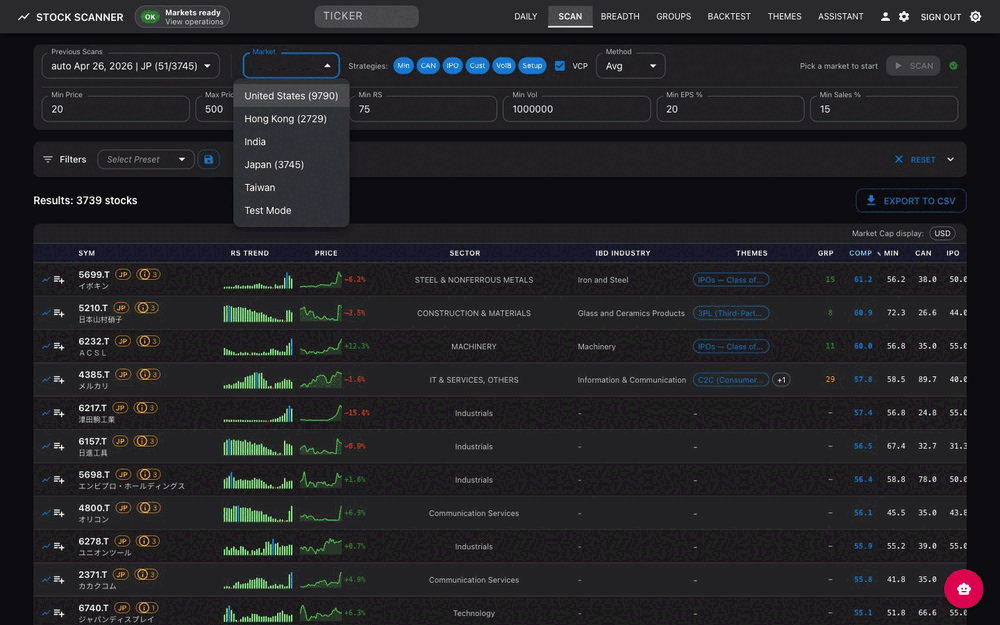
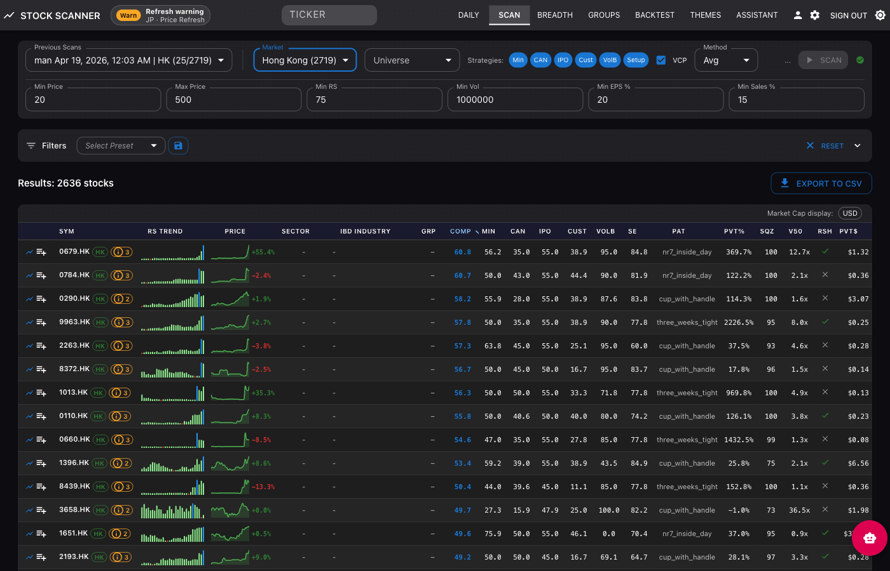
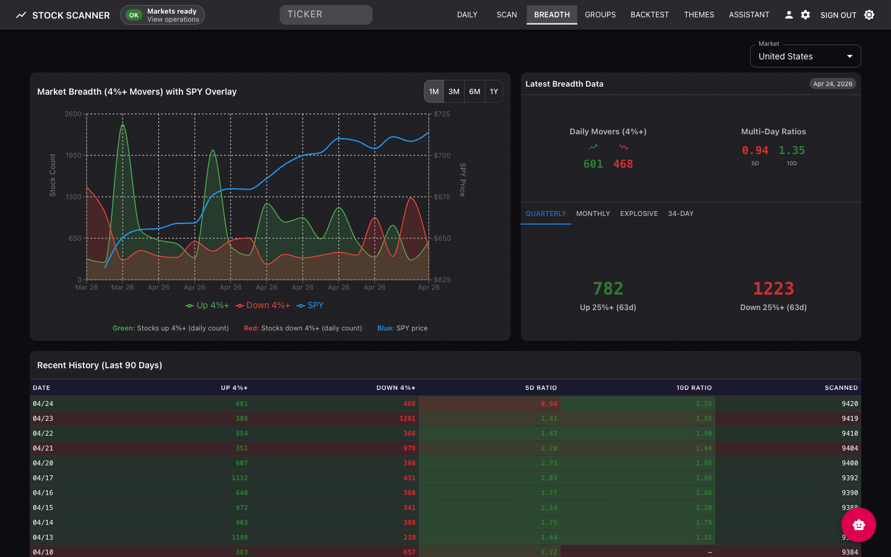

# Stock Scanner 

A comprehensive stock screening platform implementing CANSLIM (William O'Neil) and Minervini methodologies, featuring AI-powered theme discovery, multi-provider chatbot, market breadth analysis, and IBD-style group rankings.

<!-- Hero GIF showcasing the scan workflow -->


## Features

### Multi-Screener Stock Scanner

Run multiple screening methodologies simultaneously with composite scoring:
- **Minervini Template** - RS Rating > 70-80, Stage 2 uptrend, MA alignment, price 30%+ above 52-week low
- **CANSLIM** - Current quarterly EPS > 25%, Annual EPS growth > 25% 3yr, volume patterns, RS > 70
- **IPO Scanner** - Recent IPOs with momentum characteristics
- **Volume Breakthrough** - Unusual volume with price action
- **Custom Scanner** - 80+ configurable filters with saved presets


*Results table with composite scores, RS sparklines, and multi-screener ratings*


*80+ filters organized by Fundamental, Technical, and Rating categories*

### Watchlists

Track your stocks with visual performance indicators:
- RS and price sparklines (30-day trends)
- Price change bars across 7 time periods (1D to 12M)
- Drag-and-drop organization with folders
- Full-screen chart modal with keyboard navigation


*Watchlist with sparklines and price change visualization*

### Market Breadth Analysis

StockBee-style breadth indicators for market health assessment:
- Advance/decline metrics with SPY overlay
- Daily movers (stocks up/down 4%+)
- Multi-period analysis: Quarterly, Monthly, Explosive, 34-Day
- Historical breadth data table


*Breadth chart with SPY price overlay and daily movers*

### IBD Group Rankings

Industry group analysis inspired by IBD methodology:
- Rankings for 197 industry groups by relative strength
- Top movers identification (1W/1M/3M/6M)
- Group detail modal with historical rank charts
- Constituent stocks with growth metrics


*Industry group rankings with movers panel*


*Group detail modal with rank history chart and constituents*

### AI Research Chatbot

Multi-provider LLM integration for stock research:
- Providers: Groq, DeepSeek, Together AI, OpenRouter, Gemini
- Web search integration (Tavily, Serper, DuckDuckGo)
- Persistent chat history with session management
- Research mode with tool execution


*AI chatbot with conversation sidebar and research mode*

### Theme Discovery

AI-powered identification of market themes and trends:
- Automatic theme clustering from stock movements
- Trending vs emerging theme detection
- Theme constituent tracking and analysis
- Source filtering (Substack, Twitter, News, Reddit)


*Theme discovery with rankings and emerging themes panel*

## Tech Stack

### Backend
- **Framework**: FastAPI
- **ORM**: SQLAlchemy with SQLite
- **Task Queue**: Celery with Redis broker
- **Caching**: Redis (3 databases: broker, results, application cache)

### Frontend
- **Framework**: React 18 with Vite
- **UI**: Material-UI (MUI)
- **Data Fetching**: TanStack Query (React Query)
- **Tables**: TanStack Table with TanStack Virtual
- **Charts**: Recharts, lightweight-charts (TradingView-style candlestick charts)
- **Drag & Drop**: @hello-pangea/dnd

### Data Sources
- **yfinance** - Price/volume data (1 req/sec)
- **Finviz** - Screener data (rate-limited)
- **Alpha Vantage** - Fundamental data (25 req/day free tier)
- **SEC EDGAR** - Filings data (10 req/sec)
- **xui-reader (Playwright UI)** - Twitter/X source ingestion for theme discovery

### LLM Providers
Groq, DeepSeek, Together AI, OpenRouter, Gemini

## Quick Start

### Prerequisites
- Python 3.9+
- Node.js 18+
- Redis server

### Backend Setup

```bash
cd backend
python3 -m venv venv
source venv/bin/activate
pip install -r requirements.txt
pip install -e ../xui-reader
python -m playwright install chromium

# Configure environment
cp .env.example .env
# Edit .env with your API keys and database path

# Bootstrap shared xui profile/session state for twitter ingestion (one-time)
xui config init --path ../data/xui-reader/config.toml
xui profiles create default --path ../data/xui-reader/config.toml
xui auth login --profile default --path ../data/xui-reader/config.toml

# Optional (preferred for Google-linked X accounts):
# Use Themes -> Manage Sources -> "Connect From Current Browser"
# after loading unpacked extension from browser-extension/xui-session-bridge

# Start the API server
uvicorn app.main:app --reload --host 0.0.0.0 --port 8000
```

### Start Celery Workers (Required for Scans)

```bash
cd backend
./start_celery.sh

# Or manually:
./venv/bin/celery -A app.celery_app worker --pool=solo -Q celery -n general@%h
./venv/bin/celery -A app.celery_app worker --pool=solo -Q data_fetch -n datafetch@%h
./venv/bin/celery -A app.celery_app worker --pool=solo -Q user_scans -n userscans@%h
./venv/bin/celery -A app.celery_app beat --loglevel=info  # Scheduler
```

### Frontend Setup

```bash
cd frontend
npm install
npm run dev      # Development server on :5173
npm run build    # Production build
```

### Docker Deployment

The project uses a layered Docker Compose architecture supporting three deployment scenarios:

#### Local Development (Zero Config)
```bash
# 1. Set up environment (required for chatbot/LLM features)
cp .env.docker.example .env
# Edit .env: Add your API keys (GROQ_API_KEY, GEMINI_API_KEY, etc.)

# 2. Start all services
docker-compose up
```
Starts Redis, Backend API, Celery workers, and Frontend. Access at http://localhost

> **Note:** Docker Compose reads environment variables from `.env` in the project root (not `.env.docker`). Without this file, LLM API keys will be empty and the chatbot won't work. Scanning and other features work without API keys.

#### Homelab (Behind Reverse Proxy)
For deployment behind Traefik, nginx proxy manager, or similar:
```bash
# 1. Configure environment
cp .env.docker.example .env.docker
# Edit .env.docker: Set CORS_ORIGINS=https://stocks.home.lan

# 2. Start with production settings
docker-compose -f docker-compose.yml -f docker-compose.prod.yml up -d

# 3. Configure your reverse proxy to forward to port 80
```

#### VPS with Auto-HTTPS (Hostinger, DigitalOcean, etc.)
Includes Caddy for automatic Let's Encrypt certificates:
```bash
# 1. Configure environment
cp .env.docker.example .env.docker
# Edit .env.docker: Set DOMAIN=stocks.yourdomain.com
# Edit .env.docker: Set CORS_ORIGINS=https://stocks.yourdomain.com

# 2. Ensure DNS A record points to your server IP

# 3. Start with HTTPS
docker-compose -f docker-compose.yml -f docker-compose.prod.yml -f docker-compose.https.yml up -d
```

#### Docker Files
| File | Purpose |
|------|---------|
| `docker-compose.yml` | Base configuration for local development |
| `docker-compose.prod.yml` | Production overlay: resource limits, health checks, logging |
| `docker-compose.https.yml` | HTTPS overlay: Caddy with automatic Let's Encrypt |
| `.env.docker.example` | Template for Docker environment variables |
| `Caddyfile` | Caddy configuration for TLS termination |

#### Upgrade Note
The backend runs as non-root user (uid 1000). If upgrading from an older version:
```bash
sudo chown -R 1000:1000 ./data
```

## Documentation

- [Backend README](backend/README.md) — Architecture details, API reference, database schema, and development guide
- [Frontend README](frontend/README.md) — Component structure, patterns, conventions, and development guide

## Application Pages

| Route | Page | Description |
|-------|------|-------------|
| `/` | Routine | Market dashboard with Key Markets, Themes, Watchlists, Stockbee tabs |
| `/scan` | Bulk Scanner | Multi-screener scanning with 80+ filters and CSV export |
| `/breadth` | Market Breadth | StockBee-style breadth indicators and trends |
| `/groups` | Group Rankings | IBD industry group rankings with movers |
| `/themes` | Themes | AI-powered theme discovery with trending/emerging detection |
| `/chatbot` | Chatbot | Multi-provider AI research assistant with web search |
| `/stock/:symbol` | Stock Detail | Individual stock analysis with charts and fundamentals |

## API Documentation

Visit `http://localhost:8000/docs` for interactive Swagger documentation.

### Endpoint Groups

**Core:**
- `/api/v1/scans` — Scan management and results
- `/api/v1/stocks` — Stock data, fundamentals, chart data
- `/api/v1/features` — Feature store management

**Market Analysis:**
- `/api/v1/breadth` — Market breadth indicators
- `/api/v1/groups` — IBD group rankings
- `/api/v1/themes` — Theme discovery and analysis
- `/api/v1/technical` — Technical indicators
- `/api/v1/fundamentals` — Fundamental data

**AI & Research:**
- `/api/v1/chatbot` — AI chat sessions and messages
- `/api/v1/chatbot/folders` — Chat folder management
- `/api/v1/prompt-presets` — Saved chatbot prompts

**User Data:**
- `/api/v1/user-watchlists` — Watchlist management
- `/api/v1/user-themes` — User theme management
- `/api/v1/market-scan` — Dashboard market scan lists
- `/api/v1/filter-presets` — Saved scan filter configurations

**System:**
- `/api/v1/universe` — Stock universe management
- `/api/v1/cache` — Cache management
- `/api/v1/tasks` — Background task status
- `/api/v1/config` — Admin configuration
- `/api/v1/data-fetch-status` — Data fetch monitoring
- `/api/v1/ticker-validation` — Ticker symbol validation

**Health Endpoints (root-level):**
```
GET /livez   — Liveness probe (zero dependencies)
GET /readyz  — Readiness probe (checks DB + Redis)
GET /health  — Deprecated alias for /readyz
```

## Architecture

### Multi-Screener Orchestrator
The scan orchestrator (`scanners/scan_orchestrator.py`) coordinates all screener types:
- All screeners extend `BaseStockScreener` abstract class
- The `DataPreparationLayer` fetches data once and distributes it to all active screeners
- Composite scoring via configurable aggregation (weighted_average, maximum, minimum)

### Two-Queue Celery Architecture
- `celery` queue: General compute tasks (4 workers)
- `data_fetch` queue: API calls (1 worker, serialized to respect rate limits)

### Redis Caching Strategy
- DB 0: Celery broker
- DB 1: Celery results (24h TTL, auto-cleanup)
- DB 2: Application cache — price data (7d TTL), fundamentals (7d TTL), benchmark/SPY (24h TTL with distributed locking)

### Feature Store
Pre-computed daily stock snapshots stored in `stock_feature_daily`. A scheduled feature run scores every stock in the universe, then atomically publishes via pointer swap. Scan API endpoints read from the latest published run. Lifecycle: RUNNING → COMPLETED → quality checks → PUBLISHED (or QUARANTINED).

### Layered Architecture
Clean separation: `domain/` (business rules, ports) → `use_cases/` (application services) → `infra/` (SQLAlchemy repos, Celery) → `api/` (FastAPI routes). DI wired in `wiring/bootstrap.py`. See [Backend README](backend/README.md) for details.

## Database

**Important**: The application uses an absolute path for the database to prevent working-directory issues.

```env
DATABASE_URL=sqlite:////Users/admin/StockScreenClaude/data/stockscanner.db
```

The production database is located at `data/stockscanner.db` in the project root. Do not create databases in `backend/data/` or other subdirectories.

### Key Tables
- `stock_prices`, `stock_fundamentals`, `stock_universe` — Core stock data
- `scans`, `scan_results` — Scan metadata and results with multi-screener scores
- `feature_runs`, `stock_feature_daily` — Feature Store (pre-computed scan snapshots)
- `feature_run_pointers` — Atomic publish mechanism
- `ibd_industry_groups`, `ibd_group_ranks` — Industry group rankings
- `theme_clusters`, `theme_constituents` — Theme discovery
- `chatbot_conversations`, `chatbot_messages` — Chatbot conversation history
- `user_watchlists`, `watchlist_items` — Watchlist management
- `user_themes`, `user_theme_stocks` — User theme tracking

## Environment Variables

### Local Development
Create a `.env` file in the `backend/` directory (see `backend/.env.example`):

```env
# Database (MUST use absolute path: sqlite:/// + /absolute/path)
DATABASE_URL=sqlite:////Users/yourusername/StockScreenClaude/data/stockscanner.db

# Redis
REDIS_HOST=localhost
CELERY_BROKER_URL=redis://localhost:6379/0

# Admin API key (required for /api/v1/config/* endpoints)
ADMIN_API_KEY=your_key

# LLM Providers (at least one required for chatbot)
GROQ_API_KEY=your_key
GEMINI_API_KEY=your_key
DEEPSEEK_API_KEY=your_key      # Cost-effective fallback
TOGETHER_API_KEY=your_key      # Wide model selection
OPENROUTER_API_KEY=your_key    # 100+ models

# Web Search (optional, for research mode)
TAVILY_API_KEY=your_key
SERPER_API_KEY=your_key

# Deep research safety limits
RESEARCH_READ_URL_MAX_BYTES=5000000

# Data fetch lock (seconds to wait before failing)
DATA_FETCH_LOCK_WAIT_SECONDS=7200

# Optional one-time cleanup for legacy scan universes
INVALID_UNIVERSE_CLEANUP_ENABLED=false

# Data Sources
ALPHA_VANTAGE_API_KEY=your_key
XUI_ENABLED=true
XUI_CONFIG_PATH=../data/xui-reader/config.toml
XUI_PROFILE=default
XUI_LIMIT_PER_SOURCE=50
XUI_NEW_ONLY=true
XUI_CHECKPOINT_MODE=auto
XUI_BRIDGE_ENABLED=true
XUI_BRIDGE_ALLOWED_ORIGINS=http://localhost:80,http://127.0.0.1:80,http://localhost:5173,http://127.0.0.1:5173
XUI_BRIDGE_CHALLENGE_TTL_SECONDS=120
XUI_BRIDGE_MAX_COOKIES=300
TWITTER_REQUEST_DELAY=5.0

# LLM Routing (optional, sensible defaults)
LLM_DEFAULT_PROVIDER=groq
LLM_CHATBOT_MODEL=groq/qwen-qwen3-32b
LLM_FALLBACK_ENABLED=true

# Scanning
DEFAULT_UNIVERSE=all
SCAN_BATCH_SIZE=20

# Celery
CELERY_TIMEZONE=America/New_York
```

### Docker Deployment
Create a `.env` file in the project root from the template (Docker Compose requires this exact filename):
```bash
cp .env.docker.example .env
```

```env
# Deployment
DOMAIN=stocks.yourdomain.com           # For HTTPS scenario
CORS_ORIGINS=https://stocks.yourdomain.com

# API Keys (same as local dev)
GROQ_API_KEY=your_key
# ... other keys
```

## Development Notes

### macOS Celery Configuration
Use `--pool=solo` to avoid fork() crashes from Objective-C runtime safety checks:

```bash
export OBJC_DISABLE_INITIALIZE_FORK_SAFETY=YES
export TOKENIZERS_PARALLELISM=false
```

The `start_celery.sh` script handles this automatically.

### Rate Limits
- **yfinance**: 1 req/sec (self-imposed)
- **Finviz**: Rate-limited via wrapper
- **Alpha Vantage**: 25 req/day free tier
- **SEC EDGAR**: 10 req/sec (150ms between requests)

## Disclaimer

This software is for educational and research purposes only. It is not financial advice. Always do your own research and consult with a licensed financial advisor before making investment decisions.
