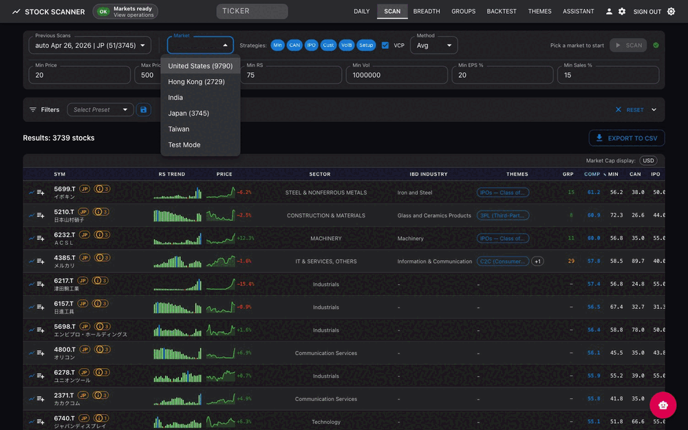
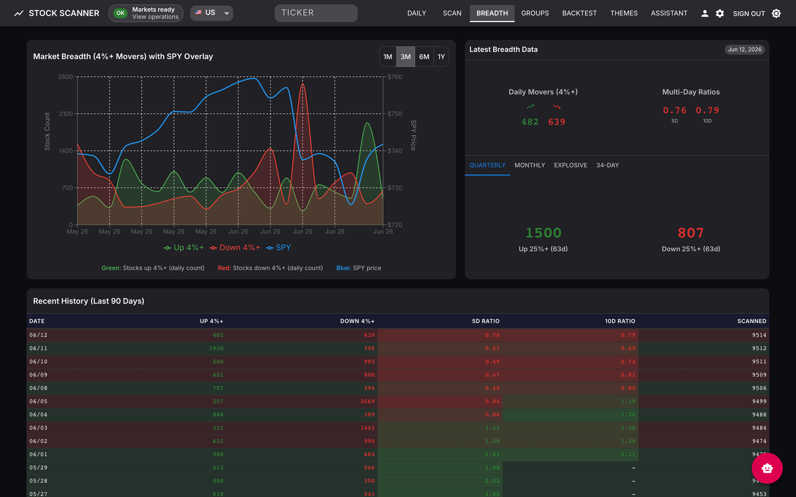
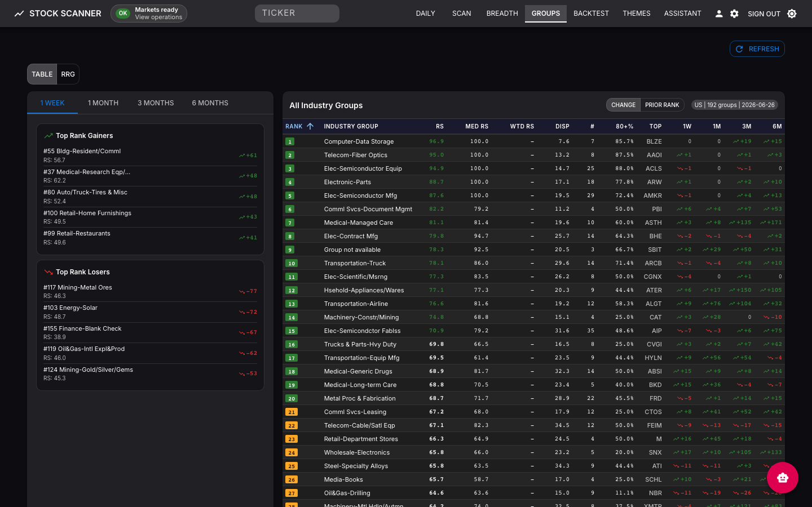
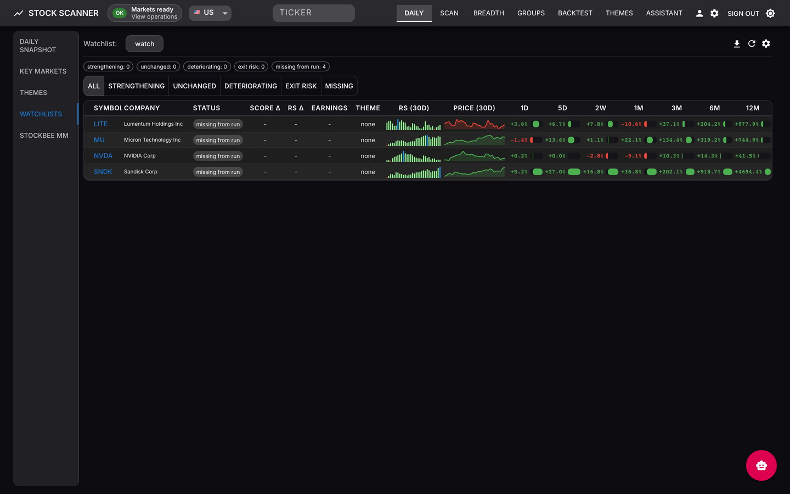

# StockScreenClaude

A professional stock screening platform with 6 screening methodologies, AI-powered research, theme discovery from social and news feeds, and real-time market breadth analysis. Runs as a Docker stack, native macOS app, or Windows desktop application.



## Highlights

### Multi-Strategy Screening

Run Minervini, CANSLIM, IPO, Volume Breakthrough, Setup Engine, and Custom scans simultaneously with composite scoring across 80+ configurable filters. Save filter presets and export results to CSV.


*Results table with composite scores, RS sparklines, and multi-screener ratings*

### AI Research Chatbot

6 LLM providers (Groq, DeepSeek, Together AI, OpenRouter, Gemini, Z.AI) with web search research mode, persistent conversation history, and tool-augmented investigation.


*AI chatbot with conversation sidebar and research tools*

### Theme Discovery Pipeline

AI-powered market theme identification from RSS, Twitter/X, and news feeds. Tracks trending vs. emerging themes, monitors constituent stocks, and alerts on momentum shifts.


*Theme discovery with rankings and emerging themes panel*

### Market Breadth Dashboard

StockBee-style advance/decline analysis with SPY overlay, daily movers (stocks up/down 4%+), and multi-period trend visualization across quarterly, monthly, and 34-day windows.


*Breadth chart with SPY price overlay and daily movers*

### IBD Industry Group Rankings

197 industry groups ranked by relative strength with top movers identification (1W/1M/3M/6M), historical rank charts, and constituent stock analysis.


*Industry group rankings with movers panel*

### Watchlists with Sparklines

Visual performance tracking with RS and price sparklines (30-day trends), price change bars across 7 time periods, drag-and-drop organization with folders, and full-screen chart navigation.


*Watchlist with sparklines and price change visualization*

## Get Started

### Docker (Recommended for Servers)

```bash
cp .env.docker.example .env
# Edit .env: set SERVER_AUTH_PASSWORD and add at least one LLM API key (e.g., GROQ_API_KEY)
docker-compose up
# Open http://localhost
```

Full guide with homelab, VPS, and GHCR deployment options: **[Docker Deployment](docs/INSTALL_DOCKER.md)**

### macOS Desktop

Download `StockScanner.dmg` from [GitHub Releases](../../releases), drag to Applications, and launch.

Full guide: **[macOS Installation](docs/INSTALL_MACOS.md)**

### Windows Desktop

Download `StockScanner-Setup.exe` from [GitHub Releases](../../releases) and run the installer.

Full guide: **[Windows Installation](docs/INSTALL_WINDOWS.md)**

### From Source (Contributors)

See the **[Development Guide](docs/DEVELOPMENT.md)** for full backend + frontend + Celery setup.

## Configuration

The AI chatbot requires at least one LLM provider API key. Scanning and all other features work without any keys.

| Provider | Env Var | Free Tier | Notes |
|----------|---------|-----------|-------|
| Groq | `GROQ_API_KEY` | Yes | Fast inference, recommended to start |
| Gemini | `GEMINI_API_KEY` | Yes | Also used for theme extraction |
| DeepSeek | `DEEPSEEK_API_KEY` | No | Cost-effective fallback |
| Together AI | `TOGETHER_API_KEY` | No | Wide model selection |
| OpenRouter | `OPENROUTER_API_KEY` | No | 100+ models |
| Z.AI | `ZAI_API_KEY` | No | GLM models |

Optional web search keys (`TAVILY_API_KEY`, `SERPER_API_KEY`) enable the chatbot's research mode.

Full reference: **[Environment Variables](docs/ENVIRONMENT.md)**

## Application Pages

| Route | Page | Description |
|-------|------|-------------|
| `/` | Routine | Market dashboard with Key Markets, Themes, Watchlists, Stockbee tabs |
| `/scan` | Bulk Scanner | Multi-screener scanning with 80+ filters and CSV export |
| `/breadth` | Market Breadth | StockBee-style breadth indicators and trends |
| `/groups` | Group Rankings | IBD industry group rankings with movers |
| `/themes` | Themes | AI-powered theme discovery with trending/emerging detection |
| `/chatbot` | Chatbot | Multi-provider AI research assistant with web search |
| `/stock/:symbol` | Stock Detail | Individual stock analysis with charts and fundamentals |

## Key Capabilities

- **6 screening methodologies** with composite scoring (Minervini, CANSLIM, IPO, Volume Breakthrough, Setup Engine, Custom)
- **80+ configurable filters** with saved presets across fundamental, technical, and rating categories
- **AI chatbot** with 6 LLM providers, web search research mode, and persistent conversations
- **Theme discovery** from RSS, Twitter/X, and news sources with AI clustering and lifecycle tracking
- **Market breadth** dashboard with StockBee-style indicators and historical trends
- **197 IBD industry groups** ranked by relative strength with movers and constituent analysis
- **Watchlists** with RS/price sparklines, multi-period change bars, and drag-and-drop organization
- **MCP integration** for AI copilot workflows with 8 tools ([details](docs/MCP_INTEGRATION.md))
- **TradingView-style charts** with candlestick OHLC and technical overlays
- **CSV export** for scan results
- **Dark and light mode** UI
- **Desktop apps** for macOS (.dmg) and Windows (.exe) with bundled data
- **Docker deployment** with PostgreSQL, auto-HTTPS, and GHCR image releases

## Documentation

| Guide | Audience |
|-------|----------|
| [Docker Deployment](docs/INSTALL_DOCKER.md) | Server, homelab, VPS users |
| [macOS Installation](docs/INSTALL_MACOS.md) | macOS desktop users |
| [Windows Installation](docs/INSTALL_WINDOWS.md) | Windows desktop users |
| [Development Guide](docs/DEVELOPMENT.md) | Contributors, developers |
| [Architecture](docs/ARCHITECTURE.md) | Understanding the system design |
| [Environment Variables](docs/ENVIRONMENT.md) | Configuration reference |
| [MCP Integration](docs/MCP_INTEGRATION.md) | AI copilot workflows |
| [Backend API & Architecture](backend/README.md) | Backend developers |
| [Frontend Components](frontend/README.md) | Frontend developers |
| [Contributing](CONTRIBUTING.md) | Getting started as a contributor |

## Tech Stack

**Backend:** FastAPI, SQLAlchemy, Celery, Redis, PostgreSQL / SQLite
**Frontend:** React 18, Vite, Material-UI, TanStack Query / Table, Recharts
**Data:** yfinance, Finviz, Alpha Vantage, SEC EDGAR, xui-reader (Twitter/X)

## Disclaimer

This software is for educational and research purposes only. It is not financial advice. Always do your own research and consult with a licensed financial advisor before making investment decisions.
