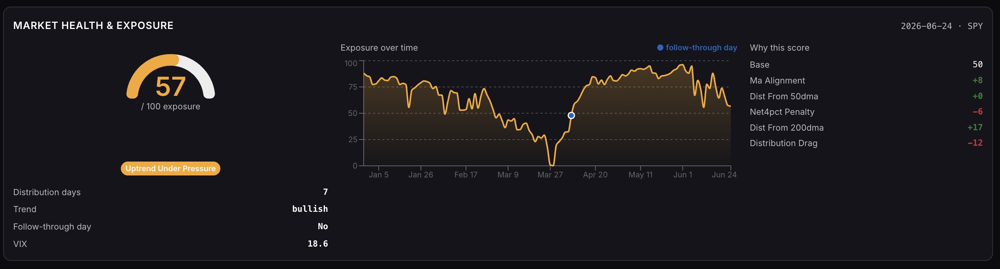

# Stock Screener 🇺🇸 🇨🇳 🇭🇰 🇯🇵 🇰🇷 🇹🇼 🇮🇳 🇩🇪 🇨🇦 🇸🇬 🇲🇾 🇦🇺

**Multi-market stock screening with technical and fundamental scans, market breadth, group rankings, theme discovery, AI-assisted research - across multiple markets.**

Scan and track **US, Hong Kong, India, Japan, Korea, Taiwan, mainland China A-shares, Germany, Canada, Singapore, Malaysia, and Australia** markets. Deployed as a single-tenant server stack built on **Docker, PostgreSQL, Redis, and nginx**.


*Daily Snapshot → Scans → Stock chart and details →  Breadth → Group Rankings*

## Use it without installing

Read-only daily snapshot running on GitHub Pages:
**[xang1234.github.io/stock-screener](https://xang1234.github.io/stock-screener/)**

Updated daily after market close. 

See the **[Static Site Guide](docs/STATIC_SITE.md)** for exactly what works in static mode.

## Features

- **12-market coverage** -  exchange calendars, independent data and scans.
- **Multiple screening methodologies** - Minervini, CANSLIM, IPO, Volume Breakthrough, etc. with composite scoring.
- **Market Health and Exposure** - Market-regime overlay for position sizing and risk posture.
- **Market Breadth** - StockBee-style advance/decline analysis with a benchmark overlay, daily movers (±4%), and quarterly / monthly / 34-day trend windows.
- **Industry groups with Relative Rotation Graph** - groups ranked by relative strength with movers (1W/1M/3M/6M) and constituent analysis, plus RRG charts plotting RS-Ratio vs RS-Momentum through (Leading → Weakening → Lagging → Improving).
- **Watchlists and Themes** - RS and price sparklines, multi-period change bars, drag-and-drop folders, and full-screen chart navigation.
- **Theme discovery** - AI theme identification from RSS, Twitter/X, and news feeds; tracks trending vs. emerging themes and alerts on momentum shifts.
- **AI research chatbot** - LLM powered chatbot with optional web search and persistent conversation history.
- **Operations** -  startup data bootstrap, runtime status, and Operations console for queues/jobs/telemetry.
- **Backtest** -  Backtest page that validates published scan picks and theme alerts against price history.

## Relative strength methodology

The canonical stock RS formula is `balanced-horizon-percentile-v2`. For each Market and trading date, the app uses one eligible stock set with complete adjusted-close data at the current session and the exact 21/63/126/189/252-session anchors. It calculates each stock's return in excess of that Market's benchmark at 1M, 3M, 6M, 9M, and 12M, then independently converts each horizon to a cross-sectional 1–99 percentile rating.

The weighted score is `20% × P1 + 30% × P3 + 20% × P6 + 15% × P9 + 15% × P12`; that score is ranked once more across the same eligible set to produce overall RS. Because weights apply to percentile ranks rather than raw returns, a 1,000% or 10,000% historical return cannot overwhelm every other horizon merely through its magnitude. Recent performance receives 50% of the weight through 1M and 3M RS.

Scan results expose overall, 1M, 3M, and 12M RS. A Group's overall, 1M, and 3M RS are equal-weight averages of those stock ratings over the same eligible constituent set, with at least three eligible stocks required; Group Rank uses only overall Group RS. Both the live and static Group tables show the 1M RS and 3M RS columns.

This methodology is inspired by IBD/CANSLIM's market-relative, percentile-ranked view of leadership, but it is not IBD's undisclosed proprietary formula. Published data carries the formula version, as-of date, universe identity, adjusted-close-only price basis, and run metadata. Live Groups, static Groups, feature enrichment, and RRG all consume the same exact Market/date/formula snapshot instead of recalculating RS independently. The RRG transformation itself is unchanged and never mixes history from different RS formula versions. `legacy-linear-v1` remains available only as an explicit rollback mode; incompatible or incomplete runs are rebuilt rather than silently reused.


*Market Health and Exposure*


*Scan results table*


*RRG: sector rotation with direction-arrowed weekly tails; full 197-group scope available from the same view*

**Typical flow:** sign in → bootstrap markets → review the Daily dashboard → run a Scan → drill into a stock → monitor Operations → validate outcomes on Backtest. For the full page-by-page tour, see the **[Live App Guide](docs/LIVE_APP_GUIDE.md)**.

## Quickstart (Docker)

Deploys tagged GHCR images instead of building locally:

```bash
cp .env.docker.example .env.docker
# Edit .env.docker:
#   BACKEND_IMAGE=ghcr.io/<owner>/stockscreenclaude-backend
#   FRONTEND_IMAGE=ghcr.io/<owner>/stockscreenclaude-frontend
#   APP_IMAGE_TAG=v1.3.0
#   SERVER_AUTH_PASSWORD=choose-a-long-random-password
#   GROQ_API_KEY=...
ENABLED_MARKETS=US,HK,CN scripts/docker-compose-enabled-markets.sh --env-file .env.docker -f docker-compose.yml -f docker-compose.prod.yml -f docker-compose.release.yml pull
ENABLED_MARKETS=US,HK,CN scripts/docker-compose-enabled-markets.sh --env-file .env.docker -f docker-compose.yml -f docker-compose.prod.yml -f docker-compose.release.yml up -d --no-build
# Open http://localhost
```

On first launch the app opens to a **first-run bootstrap** screen — no pre-seeded database needed. Pick one primary market for startup defaults and optionally enable more to hydrate in the background, then start. Enabling many markets at once noticeably slows the first run, so start with one and add the rest after the workspace is ready.

- **Homelab / VPS / local-dev compose / GHCR options:** [Docker Deployment](docs/INSTALL_DOCKER.md)
- **Building from source:** [Development Guide](docs/DEVELOPMENT.md)
- **Bootstrap stages, stale/failure handling, re-runs:** [Operations Guide](docs/OPERATIONS.md)

## Configuration

Scanning and all core features work with **no API keys**. The AI chatbot requires at least one LLM provider key.

| Provider | Env Var | Free Tier | Notes |
|----------|---------|-----------|-------|
| Groq | `GROQ_API_KEY` | Yes | Default for chatbot and research |
| Gemini | `GEMINI_API_KEY` | Yes | Extraction fallback |
| Minimax | `MINIMAX_API_KEY` | No | Primary theme-extraction provider |
| Z.AI | `ZAI_API_KEY` | No | Optional alternate provider |

Optional web-search keys (`TAVILY_API_KEY`, `SERPER_API_KEY`) enable the chatbot's research mode. Full reference: **[Environment Variables](docs/ENVIRONMENT.md)**.

## Application pages

| Route | Page | Description |
|-------|------|-------------|
| `/` | Daily | Dashboard: Daily Snapshot, Key Markets, Themes, Watchlists, Stockbee MM |
| `/scan` | Bulk Scanner | Multi-market scanning with 80+ filters, per-market badges, CSV export |
| `/breadth` | Market Breadth | StockBee-style breadth indicators and trends |
| `/groups` | Group Rankings | IBD industry group rankings, movers, and the RRG |
| `/validation` | Backtest | Deterministic validation of scan picks and theme alerts |
| `/themes` | Themes | Feature-gated AI theme discovery, review queues, pipeline controls |
| `/chatbot` | Assistant | Feature-gated AI research assistant with web search and watchlist actions |
| `/stocks/:ticker` | Stock Detail | Charts, fundamentals, themes, watchlist actions, validation history |
| `/operations` | Operations | Runtime activity, queue/job inventory, telemetry alerts, safe job controls |

## Tech stack

**Backend:** FastAPI, SQLAlchemy, Alembic, Celery, Redis, PostgreSQL
**Frontend:** React 18, Vite, Material-UI, TanStack Query / Table, Recharts
**Data:** yfinance, Finviz, Alpha Vantage, SEC EDGAR, official X API (optional)

## Documentation

| Guide | Audience |
|-------|----------|
| [Live App Guide](docs/LIVE_APP_GUIDE.md) | Users of the server-backed live application |
| [Operations Guide](docs/OPERATIONS.md) | Live-app operators and maintainers |
| [Static Site Guide](docs/STATIC_SITE.md) | Static demo users and maintainers |
| [Docker Deployment](docs/INSTALL_DOCKER.md) | Server, homelab, VPS users |
| [Development Guide](docs/DEVELOPMENT.md) | Contributors, developers |
| [Architecture](docs/ARCHITECTURE.md) | Understanding the system design |
| [Environment Variables](docs/ENVIRONMENT.md) | Configuration reference |
| [MCP Integration](docs/MCP_INTEGRATION.md) | AI copilot workflows (12 tools via stdio / Streamable HTTP) |
| [Backend API & Architecture](backend/README.md) | Backend developers |
| [Frontend Components](frontend/README.md) | Frontend developers |
| [Contributing](CONTRIBUTING.md) | Getting started as a contributor |

## Disclaimer

This software is for educational and research purposes only. It is not financial advice. Always do your own research and consult a licensed financial advisor before making investment decisions.

## License

Released under the [Apache License 2.0](LICENSE).
