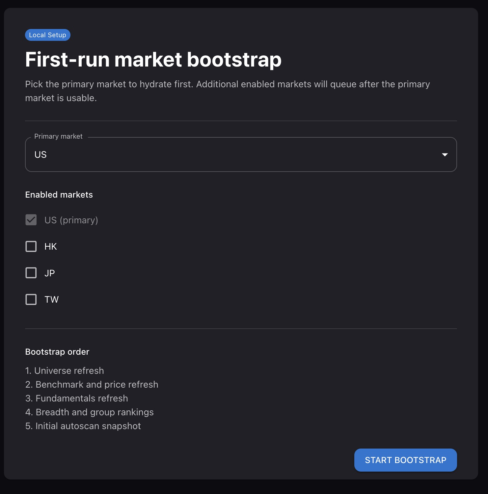
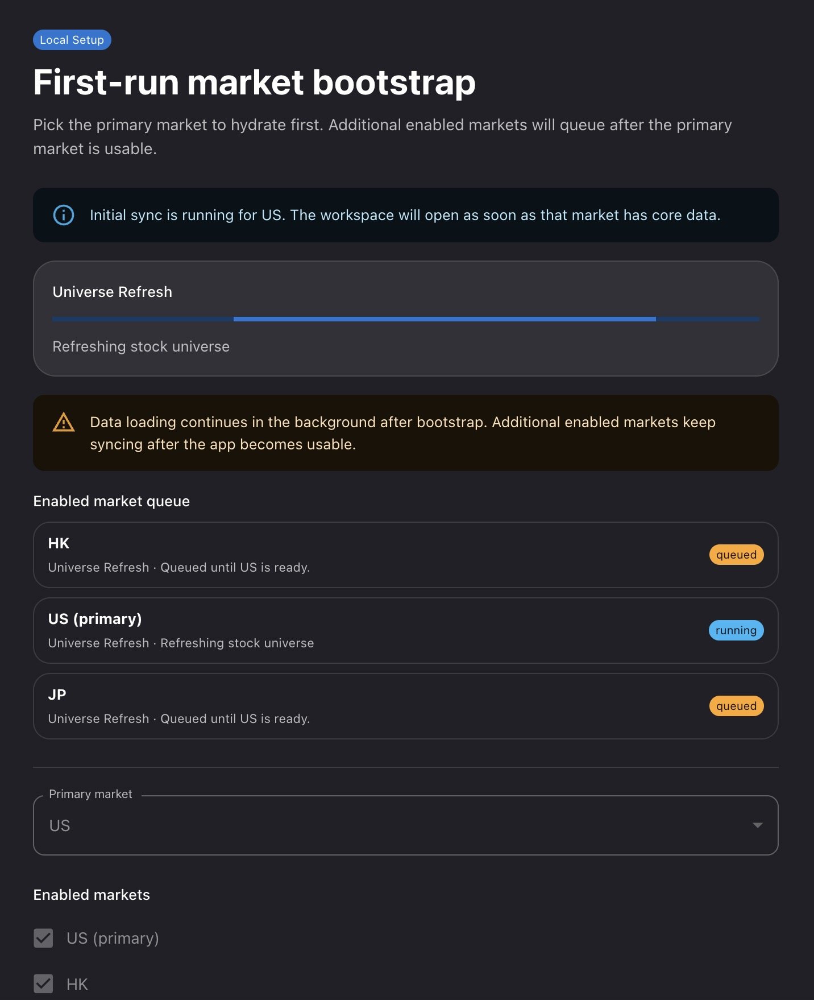
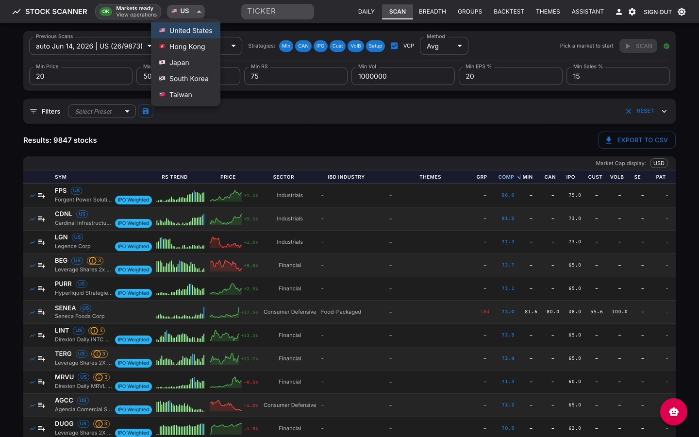
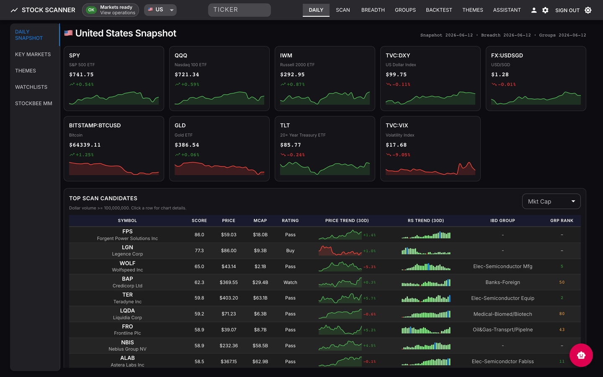
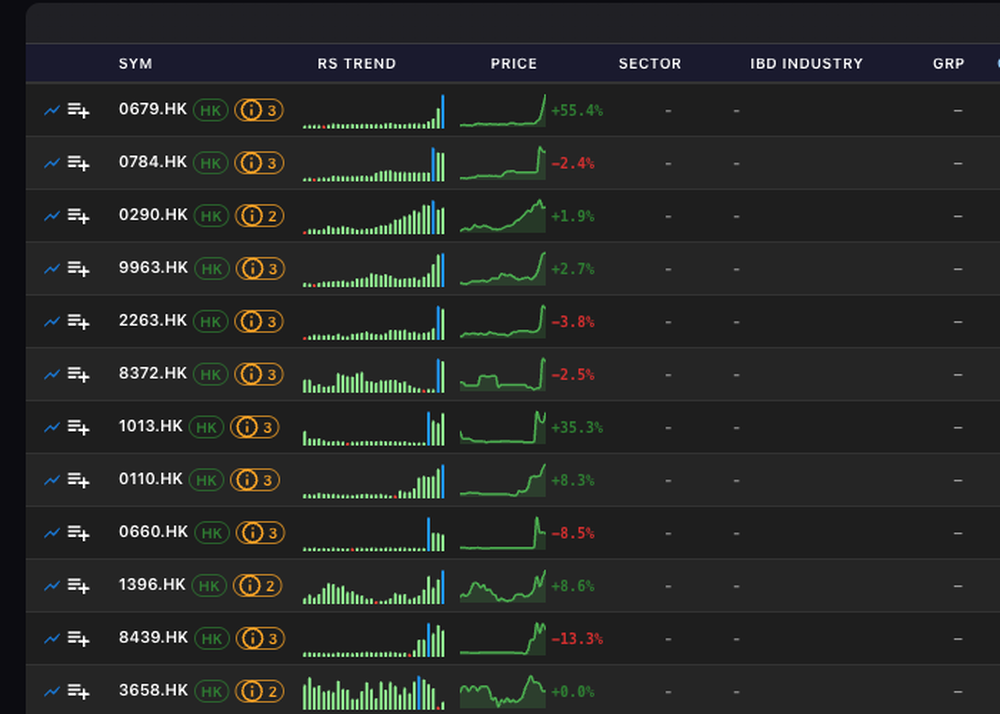
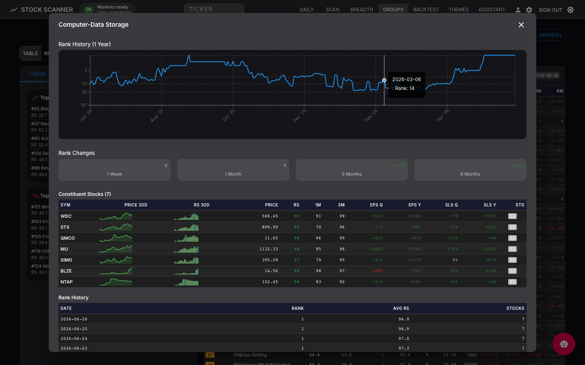

# Live App Guide

This guide covers the server-backed Stock Scanner application: the React UI, FastAPI backend, PostgreSQL database, Redis/Celery workers, and live runtime controls. It is a page-by-page tour with the methodology behind each feature. For deployment, see [Docker Deployment](INSTALL_DOCKER.md). For the read-only GitHub Pages build, see [Static Site Guide](STATIC_SITE.md).

*Daily Snapshot → Scan → stock chart → Breadth → Group Rankings*

Covers **12 markets** — US, mainland China A-shares, Hong Kong, Japan, Korea, Taiwan, India, Germany, Canada, Singapore, Malaysia, Australia — each with its own exchange calendar, data, and scans.

---

## First Launch

Server deployments can require browser login before protected API routes are available. Set `SERVER_AUTH_PASSWORD`, open the app, and sign in with the shared password.

On a fresh database the app opens to **first-run market bootstrap**:

1. Pick one **primary market** for startup defaults.
2. Optionally enable additional **markets** — only as many as the host can hydrate.
3. Start and wait for the primary market to reach `ready`; secondary markets hydrate in the background.

Enabling many markets at once noticeably slows the first run. Start with one, add the rest after the workspace opens. The header status chip links to Operations whenever runtime activity needs inspection.

| | |
|---|---|
|  |  |
| *Primary-market picker* | *Staged hydration progress* |

Stage details, stale/failure handling, and re-runs: [Operations Guide](OPERATIONS.md).

### Where market data comes from

`MARKET_DATA_SOURCE_MODE` (a deploy-time setting) controls data sourcing:

- **`github_first`** *(default)* — imports prebuilt daily-price and weekly-reference bundles from the project's GitHub releases, then live-fetches only missing/stale symbols. Prices, universe, and fundamentals fall back to live on a GitHub miss; IBD classification is GitHub-only. Faster, with fewer provider rate limits.
- **`live_only`** — skips the GitHub bundles and fetches live from yfinance / Finviz (IBD classification is GitHub-only, so it won't refresh in this mode).

It is read once at startup, so changing it means editing `.env` and recreating the stack — see [Operations Guide → Market Data Source Mode](OPERATIONS.md#market-data-source-mode).

---

## Global Controls (header)

- **Runtime activity chip** — markets ready / bootstrapping / refreshing / stale / failed; opens `/operations`.
- **Market selector** — sets the active market context for market-aware pages.
- **Ticker search** — jump to `/stocks/:ticker`.
- **Strategy profile selector** — switches scan defaults (screeners, universe, filters, composite scoring).
- **Scheduled Tasks** — *(feature-gated)* view and trigger registered background jobs.
- **Assistant drawer** — *(feature-gated)* research assistant when chatbot support is enabled.
- **Theme toggle** — dark/light mode.
- **Sign out** — appears when server auth is enabled.

*Market selector — switches the active market context*

---

## Live Routes

| Route | Page | What it does |
|-------|------|--------------|
| `/` | Daily | Daily Snapshot, Key Markets, Themes, Watchlists, Stockbee MM tabs |
| `/scan` | Scan | Multi-market screener: strategy defaults, 80+ filters, composite scoring, CSV export, chart drill-ins |
| `/breadth` | Breadth | StockBee-style breadth indicators, benchmark overlay, movers, trend windows |
| `/groups` | Groups | IBD-style group/sector rankings, movers, constituents, history, and the RRG |
| `/validation` | Backtest | Deterministic follow-through validation of published scan picks and theme alerts |
| `/themes` | Themes | *(feature-gated)* theme rankings, review/merge queues, source and pipeline controls |
| `/chatbot` | Assistant | *(feature-gated)* AI research assistant with web search, citations, history, watchlist actions |
| `/stocks/:ticker` | Stock Detail | Charts, fundamentals, technicals, theme membership, watchlist actions, validation history |
| `/operations` | Operations | Runtime activity, telemetry alerts, queue/job inventory, leases, safe job controls |

Themes, Assistant, and Scheduled Tasks are gated by backend feature flags and related API keys. A disabled feature's route/control is intentionally absent.

---

## Daily

The market-review starting point, organized as vertical subtabs: **Daily Snapshot · Key Markets · Themes · Watchlists · Stockbee MM**.

### Daily Snapshot

*Daily Snapshot — index cards, the Market Health & Exposure dashboard, and scan-derived leader panels*

- **Index / benchmark cards** — SPY, QQQ, IWM, DXY, BTC, GLD, TLT, VIX, … with price, 1-day change, and a 30-day sparkline.
- **Market Health & Exposure** — the regime gauge and stance (methodology below).
- **Top Scan Candidates** — highest composite-score names from the latest published scan run, with rating and a market-cap filter; click a row to chart.
- **Leaders in Leading Groups** — high-RS stocks that sit inside top-ranked IBD industry groups, where leadership tends to concentrate.
- **Top 10 Groups** — the highest-ranked industry groups with 1W/1M rank change and the lead stock in each.

#### Market Health & Exposure

A market-regime overlay for position sizing and risk posture — a 0–100 exposure gauge with a stance label and a "why this score" breakdown (visible in the snapshot above).

| Score | Stance |
|-------|--------|
| 85–100 | Power Trend |
| 65–84 | Confirmed Uptrend |
| 50–64 | Uptrend Under Pressure |
| 30–49 | Downtrend / Caution |
| 0–29 | Correction — In Cash |

**How it is calculated.** The score starts at **50**, then adjusts on fresh same-date market data:

| Input | Effect |
|-------|--------|
| Benchmark trend | Uses the market benchmark — SPY (US), ^HSI (HK), etc. |
| Distance from 200-DMA | `(price / ma200 − 1) × 250`, capped ±30 |
| Distance from 50-DMA | `(price / ma50 − 1) × 250`, capped ±12 |
| 50-DMA vs 200-DMA | +8 if the 50-DMA is above the 200-DMA, −8 otherwise |
| Distribution days | Last 25 sessions closing ≥ 0.2% down on higher volume; first 3 ignored, each extra −3, max −20 |
| Net 4% movers | −6 if (`stocks_up_4pct − stocks_down_4pct`) is negative |
| VIX (US only) | > 20 → −8; > 30 → a further −10 |
| Below 200-DMA | Hard cap: score ≤ 50 |
| Heavy distribution | ≥ 8 distribution days → hard cap: score ≤ 45 |
| Follow-through day | Recovery heuristic can lift the floor to 45 after a correction |

### Key Markets

A single-chart navigator for the benchmark watchlist (SPY, QQQ, IWM, AGG, GLD, …): a TradingView Advanced chart with **Space / Shift+Space** to step through symbols and a settings icon to manage the list (add / remove / reorder). It renders an external TradingView widget and has no methodology of its own.

### Themes  *(user-curated)*

Distinct from the AI-discovery Themes page (`/themes`, below): this subtab is a personal, hand-built tracker with a **Theme → Subgroup → Ticker** hierarchy.

*Themes subtab — Theme → Subgroup → Ticker, with 30-day RS/price sparklines and 1D–3M change bars*

Each ticker row shows a 30-day RS sparkline, a 30-day price sparkline, and 1D/5D/2W/1M/3M change bars; subgroups collapse and expand.

**Adding themes, subgroups, and tickers** — open **Manage Themes** (the gear icon, or the `+` in the empty state):

*Manage Themes — the three add controls (theme, subgroup, ticker)*

1. **Theme** — type a name in **New theme** (left column), press Enter.
2. **Subgroup** — select the theme, type in **New subgroup name** (right column), click **Add Subgroup**.
3. **Ticker** — expand a subgroup, type a symbol in **Add symbol**, click **Add**.

Drag handles reorder any level; the trash icon deletes (cascading to children).

### Watchlists

*Watchlist — RS/price sparklines and multi-period change bars*

- RS and price sparklines (252-day), RS-trend arrow (up / flat / down).
- Multi-period change bars: 1d / 5d / 2w / 1m / 3m / 6m / 12m.
- Optional status chips (Strengthening / Unchanged / Deteriorating / Exit-risk) when stewardship data is present; per-item IBD group, earnings date, theme affiliation; CSV export.
- Drag-and-drop folders, reorderable; full-screen chart navigation.

### Stockbee MM

Embeds the StockBee Market Monitor breadth page for quick internal-strength context; the in-app [Breadth](#breadth) page computes the same family of indicators natively.

---

## Scan

The core screener. Combines multiple methodologies over the selected market/universe, then ranks by a composite score.

*Scan results — composite + per-screener scores, Sector / IBD Industry / Themes / Group columns*

**Workflow:** pick market + universe → choose screeners → apply filter preset → start scan → sort/export, or open the chart modal and drill into Stock Detail. Manual scans run **cache-only**; if a market's cached prices haven't caught up to its last trading day, the scan is rejected (`409 market_data_stale`) until the refresh clears — check Operations.

### Screeners & methodologies

| Screener | What it finds | Key pass criteria |
|----------|---------------|-------------------|
| **Minervini** (Trend Template) | Stage-2 leaders in confirmed uptrends | RS ≥ 70 (leaders ≥ 80); price > 50 > 150 > 200-DMA; 200-DMA rising ≥ 1mo; ≥ 30% above 52-wk low; ≤ 25% below 52-wk high; Weinstein Stage 2. Optional VCP bonus. |
| **CANSLIM** (O'Neil) | Fundamental + technical leaders | **C** current qtr EPS ≥ 25% (strong ≥ 40%); **A** annual EPS growth ≥ 15–25%; **N** within ~15% of 52-wk high; **S** up/down volume ratio ≥ 1.3; **L** RS ≥ 80; **I** institutional ownership ~40–80%. |
| **IPO** | Recent IPOs basing constructively | Age sweet spot 6mo–2yr; post-IPO gain ≥ 50%; low 90-day volatility (< 5%); rising volume; revenue growth QoQ ≥ 20%. |
| **Volume Breakthrough** | Unusual-volume thrusts | Volume exceeds all prior 5-year / 1-year / since-IPO highs within the last 5 sessions; bonus when ≥ 20% above the prior high; recency time-decay; rating escalates with count/magnitude of breakthroughs. |
| **Setup Engine** | Chart-pattern setups near a pivot | Detectors: Cup-with-Handle, VCP, Three Weeks Tight, High Tight Flag, First Pullback, NR7 Inside Day, Double Bottom. Outputs a quality score + a readiness score (proximity to pivot) and a `setup_ready` flag. |
| **Custom** | User-defined screen | Toggle any filters (price, volume, RS, market cap, EPS/sales growth, MA alignment, near-52wk-high, debt/equity, sector include/exclude); each contributes to a 0–100 score; passes at the user-set minimum. |

**Relative Strength (RS) Rating** underpins most screeners: excess return vs the market benchmark, weighted across periods (3mo 40%, then 6/9/12mo 20% each), scaled 0–100 (or universe percentile). Group RS is the average RS of a group's constituents.

**Composite scoring** aggregates the selected screeners — `weighted_average` (default), `maximum`, or `minimum` — to a single 0–100 score and rating: **Strong Buy** ≥ 80, **Buy** ≥ 70, **Watch** ≥ 60, **Pass** < 60. The rating is downgraded when fewer than half the screeners pass, and downgraded or forced to Pass when a stock's fundamental data is too sparse to trust.

### Filters

*Filter panel — saved presets across categories*

80+ saved-preset filter fields, grouped:

- **Valuation** — P/E, forward P/E, PEG, P/B, P/S, EV/EBITDA, target price.
- **Earnings & growth** — current EPS, EPS growth QoQ/YoY, sales growth QoQ/YoY, revenue growth, forward estimates.
- **Profitability** — profit/operating/gross margin, ROE, ROA, ROIC.
- **Financial health** — current/quick ratio, debt/equity.
- **Ownership & sentiment** — insider/institutional ownership and transactions, short float/ratio.
- **Technical** — beta, RSI(14), ATR(14), SMA 20/50/200, weekly/monthly volatility, stage.
- **Performance & range** — perf week/month/quarter/half/year/YTD, 52-week high/low distance.
- **Rating & classification** — RS rating, EPS rating, sector (GICS), IBD industry, theme membership, market.

*Enhanced (Finviz-sourced) fields are US-centric and may be blank for non-US markets.*

### Strategy presets

Presets are one-click saved configurations (screeners + filter values), seeded at install and editable. Pick one from the **Strategy profile selector** in the header. The catalog:

*Leadership & growth*

| Preset | Filters | Detects |
|--------|---------|---------|
| Minervini Trend Template | Minervini ≥ 70, Stage 2, MA aligned, RS ≥ 70 | Textbook trend-template leaders |
| CANSLIM | CANSLIM ≥ 70, EPS growth ≥ 25%, RS ≥ 80 | O'Neil growth + leadership |
| Momentum Leaders | 3M perf ≥ 30%, 6M ≥ 80%, RS ≥ 85, Stage 2 | Strongest 3–6 month momentum |
| RS Power Play | RS ≥ 90, 3M RS ≥ 85, Stage 2 | Elite relative-strength leaders |
| Leaders in Leading Groups | IBD group rank ≤ 40, RS ≥ 80 | Strong stocks inside top groups |
| Oliver Kell Growth | Price ≥ $20, EPS ≥ 25%, sales ≥ 15%, RS ≥ 80, ≤ 15% off high | Growth names near highs |
| Growth Rockets | EPS growth ≥ 40%, sales ≥ 30%, RS ≥ 70 | Triple-digit growth |
| New Highs + Volume | ≤ 5% off 52-wk high, vol surge ≥ 1.3×, RS ≥ 70 | Breakouts at new highs |
| Volume Breakthrough | Volume-breakthrough score ≥ 33 | Record-volume thrusts |
| Recent IPOs | IPO score ≥ 50 | Young IPOs acting well |

*Chart patterns & setups*

| Preset | Filters | Detects |
|--------|---------|---------|
| Episodic Pivot | Gap ≥ 10%, vol surge ≥ 2.0×, RS ≥ 70 | Earnings/news gap-up momentum (Qullamaggie EP) |
| High Tight Flag | Pattern = high_tight_flag, RS ≥ 80 | Explosive flag after a sharp run |
| Cup with Handle | Pattern = cup_with_handle, RS ≥ 70 | Classic cup base |
| Double Bottom | Pattern = double_bottom, RS ≥ 70 | Two-test base |
| First Pullback | Pattern = first_pullback, RS ≥ 70 | First retrace after a breakout |
| Three Weeks Tight | Pattern = three_weeks_tight, RS ≥ 70 | Tight continuation |
| NR7 / Inside Day | Pattern = nr7_inside_day, RS ≥ 70 | Volatility-contraction trigger |
| VCP Setups | VCP detected, Minervini ≥ 50 | Volatility-contraction bases |
| Tight Setups | ADR ≤ 4%, VCP ≥ 30, RS ≥ 80, Stage 2 | Low-volatility coils |
| Pocket Pivot | Pocket-pivot signal, RS ≥ 70 | Up-volume exceeding any down day of the prior 10 |
| Power Trend | Power-trend flag, RS ≥ 80 | Minervini Power Trend regime |
| Under Accumulation | Up/down volume ratio ≥ 1.5, RS ≥ 80, Stage 2 | Institutional accumulation |
| Blue Dot Leaders | Stage 2, RS-line new-high "blue dot", RS ≥ 80 | Leadership emerging before price |

*Super-scanners (broad sweeps)*

| Preset | Filters | Detects |
|--------|---------|---------|
| 4% Daily Gainers | Day perf ≥ 4% | StockBee 4% breadth movers |
| 9M Movers | $ volume ≥ $100M, vol surge ≥ 1.25× | Heavy dollar-volume movers |
| 20% Weekly Movers | Week perf ≥ 20% | Big weekly thrusts |
| 97 Club | Day, week, and month perf each ≥ 97th percentile | Top-3% across all horizons |

### Multi-market

Each result row carries a color-coded **market badge**; cross-market scans interleave universes (US/HK/IN/JP/TW/…).

*Per-market badges in a mixed-universe view*

---

## Breadth

StockBee-style internal-strength view with a benchmark (SPY, or a per-market ETF) overlay and a daily-movers list.

*Market Breadth — stacked advance/decline with benchmark overlay*

**Indicators (per market, daily):**

| Indicator | Definition |
|-----------|------------|
| ±4% movers | Count of stocks closing ≥ +4% / ≤ −4% vs prior close |
| 5-day / 10-day ratio | Σ up-4% ÷ Σ down-4% over the trailing 5 / 10 sessions |
| 25% in a month | Count moving ±25% over 21 sessions |
| 50% in a month | Count moving ±50% over 21 sessions |
| 13% in 34 days | Count moving ±13% over 34 sessions (IBD-style) |
| 25% in a quarter | Count moving ±25% over 63 sessions |

The **Stockbee MM** tab on the Daily page surfaces these same daily counts in a market-monitor grid. Time-range selector covers 3M/6M (and longer) windows.

---

## Groups & Relative Rotation Graph

~197 IBD-style industry groups (and sector roll-ups), ranked per market by the **average RS of their constituents** (min 3 stocks).

*Group Rankings — ranked table with top movers*

- **Movers** — rank change over 1W / 1M / 3M / 6M.
- **Group detail** — rank-history chart plus the constituent table.

*Group detail — rank history and constituents*

### Relative Rotation Graph (RRG)

Plots each group's **RS-Ratio** (x, relative-strength level) against **RS-Momentum** (y, rate of change), both normalized around 100, with weekly tails (~8 weeks). Quadrants read clockwise:

- **Leading** (x≥100, y≥100) — strong and accelerating.
- **Weakening** (x≥100, y<100) — strong but momentum rolling over.
- **Lagging** (x<100, y<100) — weak and deteriorating.
- **Improving** (x<100, y≥100) — weak but momentum turning up.

**How the axes are computed** (weekly):

- **RS-Ratio (x)** — the group's weekly average RS rating → EMA (5-week) smoothing → z-score over a trailing 26 weeks → plotted as `100 + 5 × z`, clamped 80–120. Captures the *level* of relative strength.
- **RS-Momentum (y)** — the 4-week rate-of-change of RS-Ratio → EMA (3-week) smoothing → z-score over a trailing 13 weeks → `100 + 5 × z`, clamped 80–120. Captures whether that strength is *accelerating*.

A group needs ≥ 12 weeks of history to plot and ≥ 30 weeks for a non-provisional reading; the default tail shows the last 8 weeks.

*RRG — sector rotation; full 197-group scope available from the same view*

---

## Stock Detail (`/stocks/:ticker`)

*Stock Detail — chart with moving averages and volume, the ratings/metrics panel, theme-membership chips, and expandable breakdown sections*

Symbol-level research view:

- **Chart** — OHLCV, 1mo–5y, with SMA 20/50/200, RSI(14), ATR.
- **Fundamentals** — market cap, sector/industry, EPS rating, growth, valuation metrics.
- **Technicals** — stage, Minervini score, VCP detection, MA alignment, ADR%, RS (1m/3m/12m) and RS trend.
- **Market themes** — themes the stock currently belongs to.
- **Watchlist actions** and **validation history** (entry price, 1-/5-session returns, MFE/MAE).

---

## Backtest (`/validation`)

Deterministic follow-through check on what the app actually published — **top-10 scan picks per run** and **theme alerts** (breakout, velocity-spike) — computed from cached OHLCV, so results are reproducible.

- **Lookback selector** — `30 / 90 / 180` days (default 90): which past signals to include.
- **Outcome horizons** — fixed **1-session** and **5-session** forward returns, entered at the next session's open, plus MFE/MAE over the 5-session window.
- **Metrics** — sample size, positive rate (% of events with 5-session return ≥ 0), average and median return.
- **Failure clusters** — losers bucketed by rating/stage/group (picks) or type/severity/theme (alerts).
- **Freshness** — degraded-reason flags when price history is missing.

---

## Themes (`/themes`)  *(feature-gated)*

AI-assisted market-narrative discovery.

*Themes — momentum rankings, emerging themes, source controls*

- **Sources** — Substack/news RSS, Twitter/X, Reddit (operator-managed, per-pipeline).
- **Extraction** — Minimax (primary), Gemini/Z.AI (fallback) extract theme name, tickers, sentiment, and confidence from ingested articles.
- **Dedup & merge** — embedding similarity + LLM verification; ambiguous pairs go to a human **merge-review** queue, new themes to a **candidate-review** queue.
- **Ranking signals** — mention counts (1d/7d/30d) and velocity (7d/30d ratio); equal-weight basket price returns (1d/1w/1m); RS vs SPY; breadth (% of constituents above 50/200-DMA); internal correlation.
- **Lifecycle** — candidate → active → dormant / reactivated / retired; surfaced as emerging / trending / fading.
- **Alerts** — new theme, velocity spike (≥ 3×), breakout (constituent RS > 70).
- **Pipeline controls** — source CRUD, and on-demand ingest / extract / metrics runs.

> Not to be confused with the user-curated **Themes** subtab on the Daily page, which is a personal Theme → Subgroup → Ticker tracker.

---

## Assistant (`/chatbot`)  *(feature-gated)*

LLM-backed research assistant (Groq by default) using an agent + tool-executor pattern — it answers from live app data, not just the model's training.

*Assistant — conversational research over live app data*

- **Tools** — market overview, daily digest, breadth snapshot, find candidates, explain symbol, stock lookup/snapshot, group rankings, theme state, watchlist snapshot/add, compare feature runs, task status.
- **Research mode** — optional web search (Tavily / Serper) with citations.
- **Persistence** — conversation history with folders.
- **Watchlist actions** — add-to-watchlist with a preview of addable/existing/invalid symbols.

---

## Operations (`/operations`)

Open Operations when the header chip warns, a scan is blocked by a refresh, or bootstrap looks stalled. It exposes runtime activity, telemetry alerts, the queue/job inventory, worker leases/ownership, and cancellable jobs. Detailed runtime and worker guidance: [Operations Guide](OPERATIONS.md).

---

## Methodology reference

| Signal | Threshold / window |
|--------|--------------------|
| RS rating periods | 3mo 40% · 6/9/12mo 20% each, scaled 0–100 |
| Breadth daily mover | ±4% vs prior close |
| Breadth momentum | ±13% / 34d · ±25% / 21d & 63d · ±50% / 21d |
| Group universe | ~197 IBD groups, ranked by avg constituent RS |
| RRG axes | RS-Ratio = EMA(5w)→z(26w); RS-Momentum = 4w-ROC→EMA(3w)→z(13w); both `100 + 5z`, clamp 80–120 |
| Health stance | 0–100 from base 50 → Power Trend / Confirmed / Under Pressure / Caution / In Cash |
| Composite rating | Strong Buy ≥ 80 · Buy ≥ 70 · Watch ≥ 60 · Pass < 60 |
| Backtest | lookback 30/90/180d · outcomes at 1 & 5 sessions |
| Theme alerts | new theme · velocity ≥ 3× · constituent RS > 70 |

---

*For educational and research purposes only — not financial advice.*
