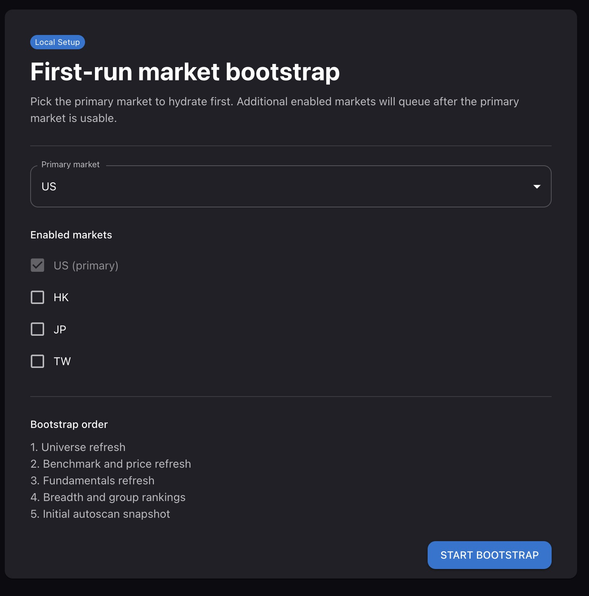
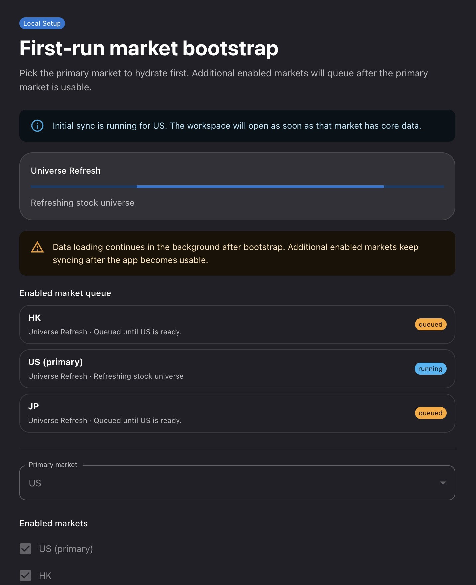

# Operations Guide

This guide covers live runtime operations for the server-backed app: starting and stopping the stack, first-run bootstrap, resetting to a clean bootstrap, enabled-market workers, runtime activity, job controls, telemetry, scheduled tasks, and common recovery paths.

## Runtime Model

The live app stores runtime choices in PostgreSQL and runs market work through Redis/Celery queues.

- `runtime.primary_market` controls the market opened first and used for startup defaults.
- `runtime.enabled_markets` controls which markets the app should hydrate and expose.
- `runtime.bootstrap_state` moves from `not_started` to `running` to `ready`.
- Runtime activity rows report per-market lifecycle, stage, progress, owner task, and warning/failure state.

The UI surfaces this through the header status chip and `/operations`.

## Starting the Stack

All start/stop goes through `scripts/docker-compose-enabled-markets.sh` — a thin wrapper around `docker compose` that derives the right Compose **profiles** from `ENABLED_MARKETS` and forwards every other argument unchanged.

**Prerequisites:** Docker (with Compose v2), Python 3.11+ on `PATH` (the wrapper uses it to compute profiles), and a `.env` (or `.env.docker`) holding at least `SERVER_AUTH_PASSWORD` and `ENABLED_MARKETS`.

```bash
# Start (detached), enabling US + four Asian markets
ENABLED_MARKETS=US,HK,JP,TW,KR scripts/docker-compose-enabled-markets.sh up -d

# Foreground (watch logs); Ctrl-C stops
ENABLED_MARKETS=US,HK,JP,TW,KR scripts/docker-compose-enabled-markets.sh up

# Stop and remove containers
ENABLED_MARKETS=US,HK,JP,TW,KR scripts/docker-compose-enabled-markets.sh down
```

Open the app at the deployment URL and sign in with `SERVER_AUTH_PASSWORD`. The wrapper prints the resolved `ENABLED_MARKETS` and `COMPOSE_PROFILES` before running.

### Options

| Capability | How |
|------------|-----|
| Select market workers | `ENABLED_MARKETS=US,HK,JP,TW,KR` as an env var, or set it in `.env` / `.env.docker`. Default: `US`. |
| Any Compose subcommand | Forwarded verbatim: `up`, `up -d`, `down`, `pull`, `ps`, `logs -f`, `restart <service>`. |
| Compose overlays | Append `-f docker-compose.yml -f docker-compose.prod.yml …` for prod/HTTPS/release layers. |
| Env file | Auto-uses `.env`, then `.env.docker`; override with `--env-file <path>`. |
| Extra profiles | `COMPOSE_PROFILES=…` is merged with the derived market profiles. |
| Python interpreter | Pin with `STOCKSCREEN_PYTHON=/path/to/python3.11+` if the default isn't 3.11+. |

### Selecting enabled markets

The base Compose file defines workers for every supported market, but market-specific workers sit behind Compose profiles. The wrapper starts only the profiles required by `ENABLED_MARKETS`.

For `ENABLED_MARKETS=US,HK,JP,TW,KR`, Docker starts the US/HK/JP/TW/KR market-job and user-scan workers; CN/IN/DE/CA/SG/MY/AU containers are not created, and the global data-fetch worker listens only to those markets' `data_fetch_*` queues.

Keep the first-run wizard's enabled markets within the deployment `ENABLED_MARKETS` set. To add a market later, update `ENABLED_MARKETS` and recreate:

```bash
ENABLED_MARKETS=US,HK,JP,TW,KR,CN scripts/docker-compose-enabled-markets.sh up -d
```

> **Note:** `down` always tears down **all** market profiles (not just the enabled ones) and auto-adds `--remove-orphans`, so it fully stops the stack regardless of the `ENABLED_MARKETS` value on that line.

## First-Run Bootstrap

On a fresh (empty) database the app opens to the first-run wizard. Choose a primary market and any secondary markets to hydrate in the background. The workspace opens when the primary market is ready; secondary markets continue on their own queues.

| | |
|---|---|
|  |  |
| *Primary-market picker* | *Staged hydration progress* |

Bootstrap stages:

1. **Universe refresh** — seeds the market symbol list. US uses S&P 500 / Russell / NDX via `refresh_stock_universe`; HK / IN / JP / KR / TW / CN / CA / DE / SG / MY / AU use official exchange feeds via `refresh_official_market_universe`.
2. **Benchmark + price refresh** — imports the GitHub daily price bundle first, accepts recent stale bundles during bootstrap, then live-fetches missing/current-session gaps (`7d` top-up for stale symbols, `2y` for no-history symbols). Under `live_only` this stage skips the bundle and fetches live — see [Market Data Source Mode](#market-data-source-mode).
3. **Fundamentals refresh** — loads quarterly and annual financials.
4. **Market RS publication** — on a pristine installation, backfills the canonical balanced-horizon percentile RS history, validates a staged static export, and atomically activates the Market and Feature pointers. A database with any durable market, breadth, exposure, scan, Feature, Group, or Market RS data keeps the balanced calculation in shadow mode until an operator activates it.
5. **Breadth calculation** — computes StockBee-style advance/decline data with gap-fill.
6. **Market exposure** — derives the market-regime exposure state from the refreshed breadth data.
7. **Group rankings** — averages canonical constituent RS values for each group, using the active formula for that market.
8. **Feature snapshot** — daily Setup Engine feature rollup for each enabled Market, using that Market's universe and publication pointer.
9. **Group history** — after activation, seeds formula-compatible history used by 1W/1M/3M/6M rank changes, movers, and RRG.
10. **Initial autoscan** — publishes the first default-profile scan.

Selecting many enabled markets multiplies this work. On smaller hosts, start with one primary market and add markets after the workspace is ready.

## Market Data Source Mode

`MARKET_DATA_SOURCE_MODE` controls **where market data is sourced from**. It is a Pydantic setting read once at process startup by every app and worker container (from `.env` / `.env.docker`); there is no runtime toggle.

| Value | Behavior |
|-------|----------|
| `github_first` *(default)* | Pull prebuilt data from the project's GitHub release bundles first, then live-fetch only what's missing or stale. |
| `live_only` | Skip the GitHub bundles; fetch live from yfinance / Finviz — **except IBD classification, which has no live source and simply stops refreshing** (see below). |

The valid values are `github_first` and `live_only` (not `live`).

**What `github_first` pulls from GitHub** — published release bundles are tried before live providers, both during bootstrap and on the weekly schedule:

- **Daily prices** — a per-market 2-year OHLCV bundle (release tag `daily-price-data`). Imported when the manifest is fresh (within ~4 days) and the checksum matches, then live top-ups fill stale / no-history symbols.
- **Weekly universe** — `refresh_stock_universe` / `refresh_official_market_universe` check the GitHub weekly-reference bundle first; if current it no-ops, if missing/stale it falls back to live universe sources.
- **Weekly fundamentals** — `refresh_all_fundamentals` tries the GitHub weekly-reference bundle before the live provider path.
- **Weekly IBD classification** — syncs the GitHub `ibd-classification-data` bundle (Sunday, after the weekly classifier publishes). **GitHub-only: there is no live provider for IBD classification**, and it is how non-US markets without a curated CSV get IBD coverage.

For prices, universe, and fundamentals, any GitHub miss (missing/stale manifest, checksum mismatch, network error) silently falls back to live, so `github_first` is safe to leave on; its benefit is speed and fewer provider rate-limit hits (the heavy history downloads as one bundle instead of symbol-by-symbol). This is also why, under `github_first`, some Celery jobs still reach GitHub *after* bootstrap — expected behavior, see [issue #266](https://github.com/xang1234/stock-screener/issues/266).

`live_only` routes prices, universe, and fundamentals through live providers. **IBD classification is the exception**: it has no live source, so under `live_only` its weekly sync is a clean no-op and classifications simply stop updating — mainly affecting non-US markets, whose IBD coverage comes entirely from the GitHub bundle. Under `github_first`, the IBD sync no-ops only when the bundle is already `up_to_date`; a genuine GitHub miss (missing/stale manifest, checksum mismatch, network error) instead **fails the IBD sync and raises an alert** (unlike prices/universe/fundamentals, which quietly fall back to live), leaving the prior classifications in place until the next successful run.

**Changing it on a running app.** The value is baked into the containers at startup, so a running stack must be **stopped** for the change to take effect — recreating alone is not enough:

```bash
# 1. Put it in the env file you pass via --env-file — Compose interpolates the
#    x-app-env entry from there: .env for the base stack, .env.docker for the
#    prod overlay (the README / INSTALL_DOCKER prod commands already pass
#    --env-file .env.docker). Note: that environment: entry outranks the prod
#    overlay's own env_file, so setting it ONLY in .env.docker without passing
#    --env-file will not take effect.
#      MARKET_DATA_SOURCE_MODE=live_only      # or github_first

# 2. Stop the stack — running containers will not pick up the change
ENABLED_MARKETS=US,HK,JP,TW,KR scripts/docker-compose-enabled-markets.sh down

# 3. Start again with the new value
ENABLED_MARKETS=US,HK,JP,TW,KR scripts/docker-compose-enabled-markets.sh up -d
```

No cache flush is needed — the setting changes the *fetch strategy*, not data already stored. Switching to `live_only` keeps existing data and refreshes prices, universe, and fundamentals live going forward (IBD classification will not refresh); switching back to `github_first` resumes bundle syncing on the next refresh.

## Reset to a Clean Bootstrap

To re-run the first-run wizard from scratch (e.g. corrupt state, schema reset, or a clean demo), stop the stack, clear DB/cache/scheduler state, and start again. The Postgres directory is **moved, not deleted**, so the reset is reversible.

```bash
# 1. Stop the stack
ENABLED_MARKETS=US,HK,JP,TW,KR scripts/docker-compose-enabled-markets.sh down

# 2. Preserve the current DB → forces an empty one (this is what re-triggers bootstrap)
mv docker-data/postgres docker-data/postgres.saved.$(date +%Y%m%d_%H%M%S)

# 3. Drop the Redis volume (Celery broker + results + app cache)
docker volume rm $(docker volume ls -q | grep '_redis_data$')

# 4. Reset the Celery Beat schedule
rm -f data/celerybeat-schedule

# 5. Start again — the app opens to the first-run wizard
ENABLED_MARKETS=US,HK,JP,TW,KR scripts/docker-compose-enabled-markets.sh up
```

| Step | Effect |
|------|--------|
| `down` | Stops all containers (and orphans). |
| `mv docker-data/postgres …saved.<timestamp>` | Empties the live DB while keeping a timestamped backup (e.g. `postgres.saved.20260624_110650`). |
| `docker volume rm …_redis_data` | Clears the Celery broker/results and the application cache. |
| `rm -f data/celerybeat-schedule` | Forces the scheduler to rebuild its run state. |
| `up` | Boots into first-run bootstrap; watch progress on `/operations`. |

> **Warning:** steps 2–4 wipe the live database, cache, and scheduler state, and step 5 re-hydrates **every** enabled market — heavy on large `ENABLED_MARKETS` sets. The data loss is recoverable only from the moved Postgres directory (and any external backups).

**Roll back** to the pre-reset database:

```bash
ENABLED_MARKETS=US,HK,JP,TW,KR scripts/docker-compose-enabled-markets.sh down
rm -rf docker-data/postgres                                   # discard the fresh bootstrap DB
mv docker-data/postgres.saved.<timestamp> docker-data/postgres
ENABLED_MARKETS=US,HK,JP,TW,KR scripts/docker-compose-enabled-markets.sh up -d
```

## Runtime Activity

The header chip summarizes runtime state:

- **OK** — all markets are idle or ready.
- **Sync / percent** — bootstrap is running.
- **count** — one or more markets have active work.
- **Warn** — a market is stale, stuck, failed, or runtime activity cannot be checked.

Click the chip to open `/operations`.

## Operations Page


*Operations — per-market activity (states, messages, timestamps) above the filterable job console*

The Operations page includes:

- **Market activity** — per-market lifecycle, stage, message, task name, progress, and updated time.
- **Telemetry alerts** — warning/critical alerts with acknowledge controls.
- **Market health summaries** — freshness lag, benchmark age, universe drift, and completeness distribution.
- **Job console** — queued, waiting, reserved, running, stale, stuck, failed, and cancelled jobs across Celery queues.
- **Lease view** — current external-fetch and market-workload ownership.
- **Safe cancellation controls** — revoke, scan cancel, force refresh cancel, or queue removal when the backend marks an action as supported.

Use the filters (state, queue, market, task text) to narrow the job console before cancelling anything.

## Scheduled Tasks

When the tasks feature is enabled, the header settings icon opens **Scheduled Tasks**.


*Scheduled Tasks — registered jobs with schedule, last-run, status, and run-now*

The dialog shows each task's display name and description, schedule, last run time and duration, last status, and a run-now action (with polling while a task is active). Tasks are feature-gated; deployments without task support do not show this control.

## Options Command Center Operations

Options analytics are US-only and opt in with `OPTIONS_ANALYTICS_ENABLED=true`; the default is `false`. Disabled deployments do not schedule Yahoo option-chain work and do not advertise Options navigation. The job follows a successfully published daily US Feature snapshot on the existing `data_fetch_us` queue, so the normal US data-fetch worker must be running. It does not add another worker or queue family and cannot make the already-published equity pipeline fail.

The bounded cohort is the independently ranked top 40 scan Candidates plus top 40 Leaders after requiring daily USD volume strictly above $100 million. Overlap keeps both source ranks. Up to 20 recently dropped symbols remain in collection for five US sessions, while only current symbols appear in the Command Center. A normal full 100-symbol cohort uses one `^IRX` history request plus one expiration-list and one selected-chain request per symbol (201 Yahoo operations). With the three-attempt per-symbol retry budget, the hard ceiling is 601 operations. Fetch concurrency is capped at two and uses the shared yfinance limiter.

In Operations, look for **Daily US Options Analytics** and the **Options Analytics** runtime stage. Its final message reports expected, completed, core-valid, failed, retried, and coverage counts. A manual canary can be started from Scheduled Tasks or the live Command Center Refresh action. Start with a source Feature run whose current cohort contains no more than three symbols; inspect the selected monthly expiration (14–45 DTE), observation timestamp, request/retry counts, coverage, unavailable reasons, and the recorded `^IRX` risk-free/dividend assumptions before testing the full cohort.

Publication is atomic. At least 90% of current symbols must have core-valid chains; otherwise the attempted run is retained for diagnostics but the published pointer does not move. Readers continue to receive the prior published run. A static build similarly keeps fresh equity output and may copy the last compatible options bundle with `stale_relative_to_equity` shown in its manifest, command-center payload, and symbol payloads.

Aggregate published observations are retained for roughly 252 US sessions. Strike detail is retained for the latest 30 published runs. The Pages workflow transfers aggregate history through the versioned `options-history-us-v1.json.gz` release asset, so a ticker that drops out and later returns keeps its compatible lifetime history; missing sessions remain gaps and counters do not reset. Raw contracts and strike points are not included in that portable history asset.

To roll back, set `OPTIONS_ANALYTICS_ENABLED=false` and recreate the API/workers. This stops collection and removes live navigation without deleting stored runs or history. Static navigation disappears when the root manifest no longer advertises `pages.options`; an already-published static bundle remains an auditable artifact.

Yahoo is an unofficial, best-effort source. Chains may omit Greeks, open interest, volume, quotes, or expirations and can be delayed or throttled. The UI shows explicit unavailable reasons rather than fabricating replacements. Net GEX, gamma flip, call wall, and put wall are labeled **Estimated** because they are model outputs, not observed dealer positions. Activity metrics are descriptive and must not be interpreted as premium inflow, buying/selling, or a directional signal.

## Balanced Market RS Rollout

`balanced-horizon-percentile-v2` is activated independently for each Market. Its five same-set excess-return percentiles are weighted **1M 20%**, **3M 30%**, **6M 20%**, **9M 15%**, and **12M 15%** before the composite is re-ranked. Keep the prior `legacy-linear-v1` Market formula pointer and legacy Feature-run ID until the rollout is accepted.

### Fresh database activation

Runtime bootstrap classifies a pristine installation once, before dispatch, and records that decision in the bootstrap manifest. Formula-pointer and application-setting provisioning are allowed; any universe, price, fundamental, breadth, exposure, scan, Feature run, Group rank, or Market RS run makes the database non-pristine. The only exception is startup Group-history reconciliation that first records a valid `runtime.bootstrap.pre_bootstrap_seed_import` marker while the database is still pristine; if that startup task imports raw seed rows before the user starts bootstrap, the first dispatch may still use fresh activation as long as no bootstrap output rows exist. A failed reconciliation dispatch clears any marker it just created. The fresh marker survives an interrupted initial bootstrap, then is consumed after every enabled Market has activated balanced RS. A later repair bootstrap or explicit rollback therefore cannot silently re-activate balanced RS.

Each bootstrap dispatch owns a persisted generation for 24 hours, renewed while its market workflows are published. Duplicate starts are rejected by that generation rather than by the display-only bootstrap preference. If the API process dies before dispatch completes or callbacks are lost, the expired generation can be reclaimed by starting bootstrap again; no database edit is required. Lease expiry alone does not invalidate a callback: the still-current generation may finish until a replacement claims ownership, while callbacks from a superseded generation are ignored.

A pristine installation runs balanced Market RS backfill and guarded activation as a required stage for every enabled Market. Activation materializes trading sessions from 187 calendar days before the latest completed session through that latest session. This covers the 6M Group-rank lookup plus tolerance, exceeds the 12-week RRG minimum, and includes the current daily Feature snapshot used by the latest scan. It does not calculate every historical session in the database. Backfill, balanced Feature publication, staged static parity validation, and the two-pointer transaction must all succeed. The primary Market is not marked ready unless its formula pointer is `balanced-horizon-percentile-v2`. A failure leaves both active pointers unchanged and marks that bootstrap chain failed; correct the reported input or coverage problem and resume bootstrap.

Group history runs after activation, so its 1W/1M/3M/6M rank changes, movers, and RRG snapshots use the same balanced formula identity. The bootstrap may use the current active universe for historical dates when point-in-time membership is unavailable; this avoids an empty 12-week window but carries the documented survivor-bias tradeoff.

After bootstrap reports ready, verify the pointer and populated Group components:

```sql
SELECT market, formula_version
FROM market_rs_formula_pointers
WHERE market = 'US';

SELECT rs_formula_version,
       MAX(date) AS latest_date,
       COUNT(*) FILTER (WHERE avg_rs_rating_1m IS NOT NULL) AS rows_with_1m,
       COUNT(*) FILTER (WHERE avg_rs_rating_3m IS NOT NULL) AS rows_with_3m
FROM ibd_group_ranks
WHERE market = 'US'
GROUP BY rs_formula_version;
```

Non-pristine databases are never auto-activated, including databases that contain only inactive or historical rows and no pre-bootstrap startup seed marker. Use the explicit shadow backfill and activation procedure below. This preserves existing data and pointers until every guard passes.

### Existing database rollout

### 1. Record the rollback state

Before activation, record both active pointers. Substitute the target Market in both predicates:

```sql
SELECT market, formula_version
FROM market_rs_formula_pointers
WHERE market = 'US';

SELECT p.key, p.run_id, r.status, r.as_of_date, r.config_json
FROM feature_run_pointers AS p
JOIN feature_runs AS r ON r.id = p.run_id
WHERE p.key = 'latest_published_market:US';
```

The saved Feature run must remain present with status `published`; activation does not delete it.

### 2. Run the resumable shadow backfill

Run from `backend` with its virtual environment active. `--start-date` is optional when resuming a repaired range:

```bash
python -m app.scripts.backfill_market_rs \
  --market US \
  --through-date 2026-07-17
```

This leaves the active pointers unchanged. Inspect the JSON report: `formula_version` must be `balanced-horizon-percentile-v2`, `failed_count` and `validation_errors` must be empty/zero, every required trading date must be completed, and the latest run must reach `through_date`. A failed date is isolated for repair and the command exits nonzero.

### 3. Validate and activate atomically

Choose an absolute, empty directory that is not `STATIC_EXPORT_OUTPUT_DIR` and is not served by nginx or another web server. The activation command refuses a relative, non-empty, or configured serving directory.

```bash
python -m app.scripts.backfill_market_rs \
  --market US \
  --through-date 2026-07-17 \
  --static-staging-dir /var/tmp/stockscreen-rs-us-20260717 \
  --activate
```

The command calculates and validates the bounded 187-day activation window, builds a balanced Feature snapshot for `through-date`, stages `static-site-v3`, and checks stock/Group coverage, 1–99 ranges, contiguous deterministic Group ranks, exact formula/run/universe metadata on every Scan shard and row, live/static stock and Group parity, and formula-isolated RRG state. `--start-date` is shadow-backfill-only and is rejected with `--activate`. Approval records a fingerprint of the root manifest plus the complete staged Market tree, so any file change invalidates activation. Any failed gate exits nonzero without changing either active pointer. A successful validation updates the Market formula pointer and `latest_published_market:<MARKET>` Feature pointer in one database transaction, then invalidates Group caches. The US-only live Group bootstrap snapshot is a best-effort cache publication after activation; failures are logged and the request path can rebuild it without reverting the durable pointers.

After success, verify the JSON has `activated: true`, the expected formula/run IDs, and no validation errors. In the live app, refresh Groups and a Scan and confirm:

- the response metadata names `balanced-horizon-percentile-v2` and the activation date;
- Scan overall/1M/3M/12M RS matches the staged sample;
- Group overall/1M/3M RS and ranks match staged `markets/<market>/groups.json`;
- the Group page shows 1M RS and 3M RS columns; and
- RRG either uses balanced history or explicitly reports insufficient balanced history.

### 4. Promote static artifacts

Do not copy an unvalidated staging directory into the serving directory. After the code and Market activation are on the default branch, use the existing Static Site workflow so its combine, fallback-compatibility, frontend-build, and Pages deployment gates remain in force:

```bash
gh workflow run static-site.yml -f market_group=us
# Use market_group=asia or market_group=all for the corresponding rollout set.
```

Confirm the workflow publishes `static-site-v3`, updates the Market's `static-rrg-history-v4` release asset where applicable, and deploys Pages successfully.

### 5. Roll back one Market

Rollback is explicit and preserves all balanced and legacy history. Do not roll back while the initial bootstrap or another activation command is running. Once a fresh bootstrap has completed, its fresh-install marker has already been consumed, so a later bootstrap will not undo this rollback.

Restore both saved pointers together. First verify the recorded legacy Feature run is still `published` and its `config_json` names `legacy-linear-v1`, then replace `<LEGACY_FEATURE_RUN_ID>` in this transaction:

```sql
BEGIN;

DO $$
DECLARE
  changed_rows integer;
BEGIN
  UPDATE market_rs_formula_pointers
  SET formula_version = 'legacy-linear-v1', updated_at = CURRENT_TIMESTAMP
  WHERE market = 'US';
  GET DIAGNOSTICS changed_rows = ROW_COUNT;
  IF changed_rows <> 1 THEN
    RAISE EXCEPTION 'Expected one Market RS pointer, changed %', changed_rows;
  END IF;

  UPDATE feature_run_pointers
  SET run_id = <LEGACY_FEATURE_RUN_ID>, updated_at = CURRENT_TIMESTAMP
  WHERE key = 'latest_published_market:US';
  GET DIAGNOSTICS changed_rows = ROW_COUNT;
  IF changed_rows <> 1 THEN
    RAISE EXCEPTION 'Expected one Feature pointer, changed %', changed_rows;
  END IF;
END $$;

COMMIT;
```

The block aborts before commit unless each pointer update affects exactly one row. If it raises, issue `ROLLBACK` and investigate rather than leaving split pointers.

After commit, invalidate the affected Market's Group-ranking cache. For US, also republish the live Groups bootstrap snapshot:

```bash
python - <<'PY'
from app.services.group_rankings_cache import bump_group_rankings_epoch
from app.services.ui_snapshot_service import safe_publish_groups_bootstrap

bump_group_rankings_epoch("US")
safe_publish_groups_bootstrap()
PY
```

For a non-US Market, change the argument to `bump_group_rankings_epoch()` and omit `safe_publish_groups_bootstrap()`. Restarting the API is not a substitute for the cache epoch bump when Redis is retained.

Regenerate rollback artifacts with the workflow's explicit formula input (and the appropriate `market_group`):

```bash
gh workflow run static-site.yml \
  -f market_group=us \
  -f 'rs_formula_overrides={"US":"legacy-linear-v1"}'
```

The JSON map is per Market; omitted Markets remain on `balanced-horizon-percentile-v2`, allowing an isolated rollback without changing other current or fallback artifacts. Verify live/static metadata says `legacy-linear-v1` for the restored Market. Retain balanced rows for diagnosis; rollback changes pointers, not history. A later return to balanced static output must use a newly validated live activation and omit that Market from `rs_formula_overrides`.

## Market Calendar Maintenance

Calendar maintenance is an **annual/on-publication** operator responsibility. The
Saturday **weekly audit** only validates the checked-in manifests and warns; it
does not scrape exchange sites or change calendar data.

Reviewed official facts live in
`backend/data/market_calendars/inputs/reviewed_official_calendars.json`. The
builder validates that file and deterministically compiles it into
`backend/data/market_calendars/index.json` plus the annual files below it. An
`official` annual file is authoritative at runtime. A `provisional` file is
generated from the pinned Python calendar provider and exists for planning and
review through 2030; it does not extend `verified_through`.

The audit emits the active **180 / 90 / 60 / 30 / expired** warning band. These
warnings are non-blocking in both the weekly workflow and static-site workflow.
Runtime access hard-fails only when the requested calculation date is later than
that Market's `verified_through`; historical lookbacks before the checked-in
years remain provider-backed.

Run the audit locally from `backend/`:

```bash
../backend/venv/bin/python -m app.scripts.audit_market_calendars
../backend/venv/bin/python -m app.scripts.audit_market_calendars \
  --as-of 2026-08-08 --github-actions
```

When a first-party exchange publishes a new calendar:

1. In `inputs/reviewed_official_calendars.json`, update the Market's source,
   `official_through`, complete weekday-closure array, and any shortened
   sessions under `close_exceptions` for the new year. Exceptional close values
   are ISO times in the exchange's local timezone. Use an explicit empty array
   when the reviewed publication has no weekday closures; the optional
   `close_exceptions` year may be omitted when it has no shortened sessions.
2. Compile and review the official year:

```bash
../backend/venv/bin/python -m app.scripts.build_market_calendar_data
```

3. Review the input and generated annual/index diff. Advance coverage only
   through the last date supported by the official publication; do not hand-edit
   the generated index or annual files.
4. Inspect and test the change:

```bash
git diff -- backend/data/market_calendars
../backend/venv/bin/python -m app.scripts.audit_market_calendars
../backend/venv/bin/pytest tests/unit/domain/markets/test_calendar_coverage.py \
  tests/unit/test_market_calendar_data.py \
  tests/unit/test_market_calendar_service.py -q
```

Regenerate a Market's provisional years after a pinned provider upgrade, then
inspect the diff. Select a start year after that Market's last official file
(the generator refuses to overwrite official years). The repository-wide
builder also applies reviewed project rules such as Singapore's fixed holidays.
`--check` is the CI drift check and makes no changes:

```bash
../backend/venv/bin/python -m app.scripts.generate_market_calendar_manifests \
  --market HK --status provisional --start-year 2027 --through-year 2030
../backend/venv/bin/python -m app.scripts.build_market_calendar_data --check
```

For an emergency closure, locate and archive the first-party exchange notice,
add the closed date to that year's reviewed closure array, update the source and
check date, rebuild, run the diff and calendar tests above, then publish through
the normal review path. If only market-data feeds show a gap,
treat **no-bar data** as evidence for investigation, not a closure authority;
never infer an exchange holiday from provider absence alone.

## Common Recovery Paths

### Bootstrap Is Slow

- Check `/operations` for active market stages and queue ownership.
- Confirm the host has workers for every market selected in the wizard.
- Reduce enabled markets and restart the stack if the host is resource constrained.
- Check upstream data-provider throttling if many symbols are stuck in price/fundamental refresh.

### Scan Is Blocked

Scans can return a market-refresh blocker while a selected market is hydrating. Wait for the relevant market to leave active refresh state, or inspect `/operations` for stale/stuck work.

### Runtime Activity Looks Stale

Use `/operations` to confirm whether a live worker owns the task. If no worker owns stale running work, restart the affected worker profile and re-run the market refresh or bootstrap step.

### Job Cancellation Fails

Cancellation is intentionally conservative. If a job has no supported cancel strategy, inspect the queue/worker state first, then restart only the affected worker profile if necessary.

### Bootstrap Won't Re-Trigger

The wizard only appears on an empty database. If a stale DB persists, confirm `docker-data/postgres` was moved/emptied (see [Reset to a Clean Bootstrap](#reset-to-a-clean-bootstrap)) before restarting.

### API Docs Are Missing

Interactive API docs are disabled by default in server deployments. Set `SERVER_EXPOSE_API_DOCS=true` only for trusted local development or private environments.

## Related Docs

- [Live App Guide](LIVE_APP_GUIDE.md)
- [Docker Deployment](INSTALL_DOCKER.md)
- [Environment Variables](ENVIRONMENT.md)
- [Architecture](ARCHITECTURE.md)
