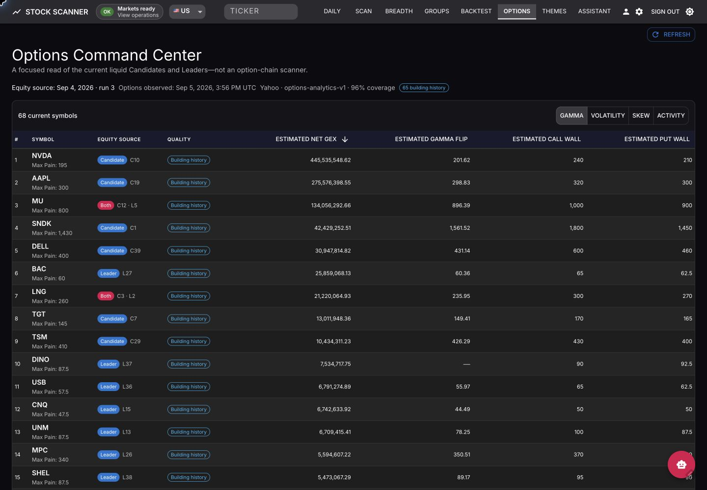

# Options Command Center

The Options Command Center adds options context to stocks that are already leading the equity scans. It is a focused dashboard, not a scanner for every optionable stock.

## What appears in the dashboard

The feature is US-only. It independently selects the top 40 Candidates and top 40 Leaders whose daily dollar volume is strictly above $100 million, then merges duplicate tickers while preserving both source ranks. Only current members appear in the table.

Use the four views to compare the same cohort:

- **Gamma** — estimated net gamma exposure, gamma flip, and call/put walls.
- **Volatility** — at-the-money implied volatility, realized volatility, and volatility risk premium.
- **Skew** — 25-delta put-call IV skew and near-spot volume concentration.
- **Activity** — volume and open-interest ratios and concentrations.

Select a column to rank available values. Tickers without that metric remain visible at the bottom. Select a ticker to open its strike charts, full metric table, history, assumptions, and quality evidence.

## Data and expiration choice

Option chains come from Yahoo through `yfinance`. Each run uses the equity snapshot's spot price and selects the earliest listed standard monthly expiration between 14 and 45 calendar days away. Holiday-adjusted monthly expirations are accepted.

The calculations use the selected chain, the latest `^IRX` rate on or before the equity date, and the ticker's dividend yield when available. Stored strike detail is limited to the nearest strike plus up to 30 strikes on each side of spot; the aggregate metrics are calculated before that storage reduction.

## Current metrics

| Metric | Calculation |
|---|---|
| Max Pain | The settlement strike that minimizes total intrinsic payout across call and put open interest. |
| Estimated Net GEX | Sum of Black-Scholes unit gamma × open interest × contract multiplier × spot² × 1%. Calls are treated as positive and puts as negative. |
| Estimated Gamma Flip | Reprices chain GEX across the selected chain, bounded below by the greater of its lowest usable strike and 80% of spot, and above by the lesser of its highest usable strike and 120% of spot. It linearly interpolates the point where net GEX changes sign. |
| Estimated Call / Put Wall | The strike with the largest absolute aggregate estimated GEX for that option side. |
| ATM IV | At the nearest strike with both sides, duplicate contracts are first aggregated within each side. That side-level IV uses open-interest weighting only when open interest is complete with a positive total; otherwise it uses a simple mean. The resulting call and put IVs are then averaged with equal weight. |
| 25-Delta Put-Call IV Skew | IV of the put nearest −0.25 delta minus IV of the call nearest +0.25 delta. Eligible absolute deltas are 0.20–0.30. |
| 20-Return Realized Volatility | Standard deviation of the latest 20 daily log returns, annualized by √252. |
| Volatility Risk Premium | ATM IV minus realized volatility. |
| Call / Put Volume | Total call volume divided by total put volume. |
| Volume / Open Interest | Total chain volume divided by total chain open interest. |
| Near-Spot Volume Concentration | Share of total volume at strikes within 5% of spot. |
| Near-Spot Open Interest Concentration | Share of total open interest at strikes within 5% of spot. |
| Activity Intensity | The same total-volume-to-open-interest ratio, exposed as the dashboard's primary activity measure. |
| Highest Contract Activity Ratio | Highest volume/open-interest ratio among contracts with volume of at least 100. Zero denominators are ignored when another valid ratio exists. This appears in ticker detail. |

Estimated GEX metrics are model outputs based on the stated call-positive/put-negative assumption. They are not observed dealer positions. Activity describes contract usage; it does not identify buying, selling, premium flow, or direction.

## History and continuity

History belongs to the ticker, not to consecutive dashboard membership. A ticker can drop out and later return without resetting its compatible observation count. Missing sessions remain gaps.

To bridge short absences, the collector can retain up to 20 recently dropped tickers for five US trading sessions. Aggregate observations are retained for roughly 252 sessions; detailed strike data is retained for the latest 30 published runs.

Historical calculations become available when enough compatible observations exist:

- **Five-observation change** — current value minus the earliest value in the latest five usable observations found within seven sessions.
- **ATM IV percentile** — share of usable ATM IV observations at or below the current value.
- **ATM IV rank** — `(current − minimum) / (maximum − minimum)` over the usable IV window.

The IV measures require at least 20 usable observations within 30 sessions. Until a threshold is met, the UI shows **Building history** instead of inventing a value.

## Quality and publication

A chain is core-valid when it has a positive spot price, at least five contracts on each side, positive aggregate open interest on each side, and at least three usable strikes. A run publishes only when at least 90% of current symbols are core-valid. If it misses that threshold, readers keep the previous published snapshot.

Individual metrics can still be unavailable when required inputs are missing or invalid. The UI shows a dash with the reason, along with the observation time, provider, calculation version, coverage, warnings, and assumptions.

## Live and static use

The live feature is opt-in with `OPTIONS_ANALYTICS_ENABLED=true` and supports a manual refresh. The static site is read-only and shows Options only when the published manifest advertises a compatible snapshot. Static history is carried forward across deployments, so ticker continuity is preserved even when daily leaders change.

Yahoo is an unofficial, best-effort source. Option data may be delayed, incomplete, or throttled. Use the dashboard as research context, not as execution data or financial advice.
